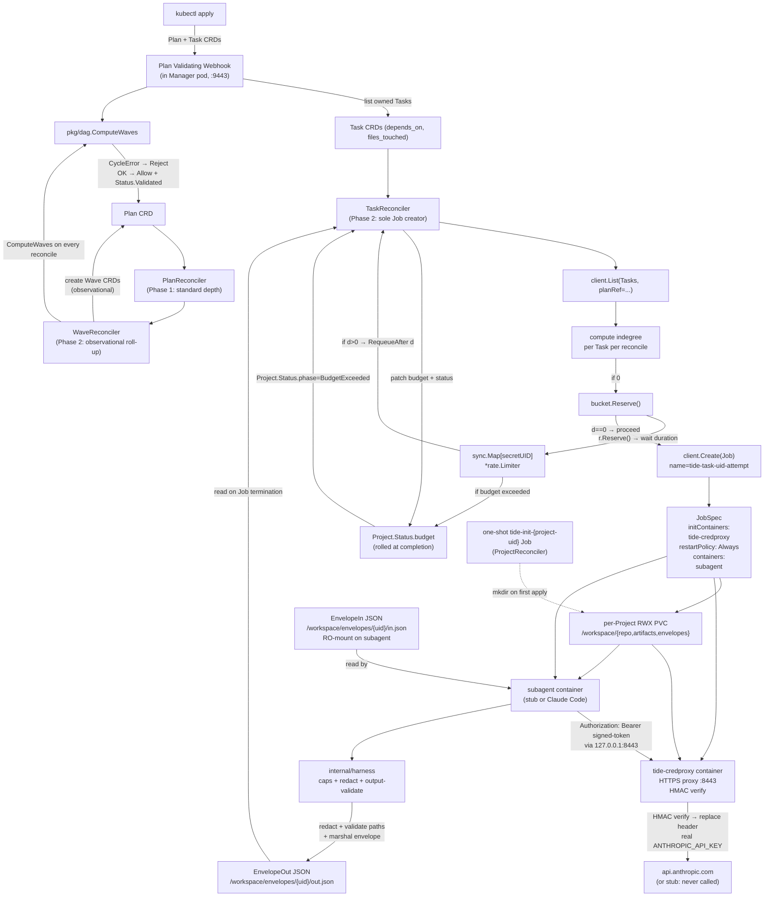

# Phase 2: Dispatch & Plan Validation — Innermost Reconcilers + Harness - Research

**Researched:** 2026-05-12
**Domain:** K8s controller dispatch (Jobs + watches), validating admission webhooks, in-process token-bucket rate limiting, HMAC-bound signed-token credential proxy (HTTPS sidecar), secret-pattern redaction in Go, integration-test ergonomics (envtest + kind + Ginkgo)
**Confidence:** HIGH for controller-runtime v0.24 webhook + reconcile patterns, Anthropic Go SDK v1.42 ANTHROPIC_BASE_URL semantics, K8s 1.33 native sidecars, golang.org/x/time/rate idioms, kind v0.31 SHA-pinning, HMAC stdlib mechanics. MEDIUM for exact envtest startup latency on dev machines (varies — published 20s default), Claude Code CLI behavior under self-signed-cert localhost proxy (works in principle; one edge-case bug in Bun runtime under specific Windows enterprise SSL inspection — not our case). LOW for nothing in this phase — all critical paths verified.

## Summary

Phase 2 lights up the dogfood-critical innermost reconciler pair (`TaskReconciler` + `WaveReconciler`) plus a credential-mediating sidecar proxy, harness-side cap enforcement and secret redaction, a Plan admission webhook that detects cycles and reconciles file-touch sets, an in-memory token-bucket rate limiter keyed by Secret UID, a stub-subagent image, and a two-layer integration test tier under 5 minutes. The CONTEXT.md decisions have already locked every high-level design choice — this research grounds the implementation patterns.

The good news from verification: every pivotal external integration **just works** for the locked design. The Anthropic Go SDK v1.42.0 reads `ANTHROPIC_BASE_URL` from env at `NewClient` time and supports `WithHTTPClient` for custom transport injection. Claude Code CLI v2.1.129+ reads the same env var, plus `ANTHROPIC_AUTH_TOKEN` for bearer-token auth — meaning the signed-token proxy plugs in with zero subagent-side code changes. K8s 1.33 made native sidecars (initContainer with `restartPolicy: Always`) GA, with the documented "Job completes when the main container finishes; kubelet then terminates sidecars in reverse spec order" semantics that perfectly fit the credproxy lifetime. controller-runtime v0.24's generic `admission.Validator[T]` interface is already wired into Phase 1's scaffold — Phase 2 fills the body with cycle detection and file-touch reconciliation. The `golang.org/x/time/rate` `Reserve()` + `RequeueAfter` pattern is the idiomatic controller-runtime answer for non-blocking rate limits.

The pitfalls are implementation-level: regex matches straddling chunk boundaries in the streaming redactor (use a tail-keep buffer), informer-cache staleness on `client.List(Tasks)` at admission time (Tasks may not yet be visible — admit-time semantics require either label-selecting freshly-applied Tasks or warning when none found), `ctrl.Result{RequeueAfter: ...}` vs blocking `Limiter.Wait()` in `Reconcile()` (only the former honors Pitfall 1), and the post-Job output-path validator needing `filepath.EvalSymlinks` before `filepath.Rel` to defeat symlink-out-of-scope writes.

**Primary recommendation:** Land the `pkg/dispatch` public envelope types **first** (lockable JSON shape, kind/apiVersion, every other Phase 2 deliverable depends on it), then the stub-subagent (proves the public-contract claim), then TaskReconciler dispatch logic (paired with the deterministic-Job-name idempotency test), then in parallel: webhook body + credproxy + harness + rate limiter. Test-tier split (Layer A envtest ~90s / Layer B kind ~3min) drops below the 5-minute budget cleanly because envtest's 20s default control-plane start + ~70s of fast-feedback assertions hits the budget; kind's cluster reuse across all Layer B tests amortizes 30s of one-time setup over 2–3 minutes of real Job lifecycle.

<user_constraints>
## User Constraints (from CONTEXT.md)

### Locked Decisions

**Envelope contract (the cross-process API):**
- **D-A1:** `EnvelopeIn` and `EnvelopeOut` Go types live in `pkg/dispatch/envelope.go` — the **public** Go contract. Out-of-tree subagent image authors import `github.com/jsquirrelz/tide/pkg/dispatch` to decode envelopes. The Phase 1 placeholder at `internal/dispatch/doc.go` is moved (the `Dispatcher dispatch.Dispatcher` field on all six reconcilers stays at `internal/dispatch.Dispatcher` for the runtime interface; envelope types are at `pkg/dispatch`).
- **D-A2:** Envelopes are JSON files on the per-Project PVC at `/workspace/envelopes/{task-uid}/in.json` (orchestrator-written, mounted read-only on subagent) and `/workspace/envelopes/{task-uid}/out.json` (harness-written, controller reads after Job completion).
- **D-A3:** Every envelope JSON carries explicit `apiVersion: tideproject.k8s/v1alpha1` + `kind: TaskEnvelopeIn | TaskEnvelopeOut`. Harness rejects unknown `apiVersion` with structured error.
- **D-A4:** Envelopes are **self-contained** — task-uid, role `planner|executor`, level `milestone|phase|plan|task`, prompt body, `filesTouched`, `dependsOn`, `declaredOutputPaths`, caps `{wallClockSeconds, iterations, inputTokens, outputTokens}`, signed-token endpoint URL + token. Subagent pod's `ServiceAccount` has **zero K8s verbs**.

**Wave ↔ Task dispatch split:**
- **D-B1:** `TaskReconciler` is the **sole** Job creator. Indegree==0 → creates `Job tide-task-{task-uid}-{attempt-n}` with `OwnerReferences` back to the Task, `BlockOwnerDeletion: true`.
- **D-B2:** `WaveReconciler` is **observational only**: on Plan ready it materializes `Wave` objects from `pkg/dag.ComputeWaves`, watches owned `Task`s, rolls up `Wave.Status.phase`. Does NOT create Jobs.
- **D-B3:** Indegree is **recomputed per reconcile** via sibling-Task query. No persisted indegree map anywhere.
- **D-B4:** `Wave.Status.phase=Succeeded` iff every member Task is `Succeeded`. Failed Task transitions Wave to `Failed` but does NOT block sibling Tasks in the same wave.
- **D-B5:** `Task.Status.Attempt` is owned by `TaskReconciler` and incremented at **Job-creation time**. Deterministic Job name `tide-task-{task-uid}-{attempt-n}` IS the dedup key. Retry cap: `Project.Spec.maxAttemptsPerTask` (Helm default 3).

**Signed-token credential proxy (HARN-03):**
- **D-C1:** Two-container Pod topology: sidecar `tide-credproxy` (HTTPS proxy + real key from `envFrom: secretRef`); subagent container with `ANTHROPIC_BASE_URL=https://127.0.0.1:8443` + `ANTHROPIC_API_KEY=<signed-token>`. Subagent env, filesystem, and process tree never touch the real key.
- **D-C2:** Transport is **localhost HTTPS** with self-signed cert minted at pod startup by the sidecar, written to a shared `emptyDir` volume mounted on both containers; subagent's CA bundle includes that cert.
- **D-C3:** Signed-token shape: **HMAC-SHA256** over `(nonce || taskUID || expiry)` with an installation-wide signing secret. Controller signs at Job-create time; proxy validates `taskUID` matches env-injected `TIDE_TASK_UID`, `expiry` not passed, MAC verifies. Signing secret from `Secret tide-signing-key` (Helm-generated on first install).
- **D-C4:** Raw `ANTHROPIC_API_KEY` delivery: `envFrom: [secretRef: {name: <Project.Spec.providerSecretRef>}]` on the **sidecar container only**. Subagent has zero `secretRef`s.

**Budget cap & rate-limit state durability:**
- **D-D1:** Token-bucket rate limiter lives **in-memory** in the controller process: `sync.Map[secretUID]*RateBucket`. Pre-charge on Manager restart from active Jobs in the last bucket-window (default 60s).
- **D-D2:** Per-Project budget tally **rolled up at Task completion** into `Project.Status.budget.{tokensSpent, costSpentCents, windowStart, absoluteCap, rollingWindowCap}`. One Status write per Task completion. Halt is structural: TaskReconciler checks before dispatching; if exceeded → `Project.Status.phase=BudgetExceeded`.
- **D-D3:** Bucket scope is **per credential Secret UID**. Per-Secret config precedence: (1) Secret annotations `tideproject.k8s/requests-per-minute`, `tideproject.k8s/tokens-per-minute`; (2) `Project.Spec.providers[].requestsPerMinute / tokensPerMinute`; (3) Helm-chart defaults.
- **D-D4:** Budget-pause recovery via annotation `kubectl annotate project foo tideproject.k8s/bypass-budget=true`; consumed (annotator removes after one allowance) OR TTL via paired `tideproject.k8s/bypass-budget-until=<RFC3339>`.

**Plan admission webhook (PLAN-01, PLAN-02, PLAN-03):**
- **D-E1:** Cycle detection via `pkg/dag.ComputeWaves` over Plan's owned Tasks; reject with `AdmissionResponse.allowed=false` + structured `Status.Details` listing cycle nodes when `CycleError` returned. No "recovery."
- **D-E2:** File-touch ↔ `dependsOn` reconciliation — derived edges from `filesTouched` compared against declared `dependsOn`. Mismatch types: (a) declared edge missing in derived (LLM under-declared); (b) derived edge missing in declared (LLM over-declared OR file-touch hallucination — Pitfall 19).
- **D-E3:** Strict/warn mode is **layered** (precedence Plan annotation > Project.Spec > Helm default):
  1. Plan annotation `tideproject.k8s/file-touch-mode=strict|warn`
  2. `Project.Spec.planAdmission.fileTouchMode=strict|warn`
  3. Helm value `planAdmission.fileTouchMode` (cluster default — `warn` in v1 chart)
- **D-E4:** Strict → `allowed=false` + Status.Details listing mismatches. Warn → `allowed=true` + `Warnings[]`. Both modes fire a K8s Event on the Plan.

**Stub-subagent (SUB-04 + TEST-02):**
- **D-F1:** Test behavior driven by envelope field `EnvelopeIn.Dev.TestMode` (enum `success | fail-exit-1 | hang | exceed-output-paths`). Real Claude-backed image (Phase 3) ignores the field.
- **D-F2:** Location: `cmd/stub-subagent/main.go` → static Go binary. Image: `ghcr.io/jsquirrelz/tide-stub-subagent:v0.1.0-dev` and `:test`. CLI: `stub-subagent --envelope /workspace/envelopes/$TIDE_TASK_UID/in.json`. **Reuses `pkg/dispatch` envelope types** — proves the public-contract claim.
- **D-F3:** Canonical stub modes: `success`, `fail-exit-1`, `hang`, `exceed-output-paths`.
- **D-F4:** Non-stub test layers: HARN-04 unit (redact_test.go fixtures); FAIL-03 unit (fake RoundTripper + 429s); HARN-03 unit (HMAC validator tampered tokens).

**PVC bootstrap (ART-01):**
- **D-G1:** `ProjectReconciler` runs one-shot `Job tide-init-{project-uid}` mounting PVC and running busybox `mkdir -p /workspace/{repo,artifacts,envelopes}`. `Project.Status.phase=Initialized` set after init Job's pod terminates with exit 0.
- **D-G2:** Per-Phase/Plan/Task artifact subdirs created **lazily** by `TaskReconciler` at dispatch time — stamps full level-path into `EnvelopeIn.declaredOutputPaths`; harness `mkdir -p`s missing ancestors before writing.
- **D-G3:** UID model: init Job + all Task Jobs + controller Manager Pod set `securityContext.fsGroup: 1000`. Orchestrator container `runAsUser: 65532`. Subagent harness `runAsUser: 1000`. Sidecar `runAsUser: 1000`.

**Integration test tier (TEST-02 <5 min budget):**
- **D-H1:** Two-layer split — Layer A envtest (~90s) for reconciler internals + admission webhook bodies; Layer B kind (~3min) for real Job lifecycle with stub-subagent. Ginkgo `--label-filter=envtest` / `--label-filter=kind`.
- **D-H2:** `make test-int` (both layers, <5min) and `make test-int-fast` (Layer A only).
- **D-H3:** Stub-subagent image load: `kind load docker-image ghcr.io/jsquirrelz/tide-stub-subagent:test`.
- **D-H4:** Minikube is the developer's local exploration tool (non-blocking). Kind is canonical CI runtime per STACK.md.

### Claude's Discretion

- **Wall-clock cap defense-in-depth.** Harness SIGTERMs subagent on internal timer expiry AND K8s `Job.spec.activeDeadlineSeconds` set to `EnvelopeIn.caps.wallClockSeconds + 30s` grace window. Planner chooses exact grace constant.
- **429 backoff timing constants.** Initial delay 250ms, exponential factor 2.0, max delay 30s, max retries 5, jitter ±25% (full-jitter strategy). Planner may adjust; document chosen values.
- **Secret-redaction regex set (HARN-04).** Start from Pitfall 18 list (`sk-ant-*`, `sk-*`, `gh[ps]_*`, `xox[abp]-*`, AWS `AKIA[A-Z0-9]{16}`, JWT `eyJ[A-Za-z0-9_-]+\.[A-Za-z0-9_-]+\.[A-Za-z0-9_-]+`). Compile once; apply to stdout, stderr, `result.json`, every artifact write before flush. Planner chooses library (stdlib `regexp` likely sufficient).
- **Output-path validation algorithm (HARN-05).** `filepath.Rel(declaredPath, actualWrite)` + reject any result starting with `../`. Symlink resolution: `filepath.EvalSymlinks` on `actualWrite` before comparison.
- **Plan admission webhook ordering vs Wave creation.** Webhook fires before etcd persists; WaveReconciler creates Wave objects only after `Status.phase=Validated`.
- **`internal/credproxy` Go module structure.** `cmd/credproxy/main.go` + `internal/credproxy/*.go` library; image at `images/credproxy/Dockerfile`.
- **Helm chart additions.** `planAdmission.fileTouchMode`, `rateLimits.defaults.requestsPerMinute`, `rateLimits.defaults.tokensPerMinute`, `images.stubSubagent.repository`, `images.credProxy.repository`. `Project.Spec` gains `providerSecretRef`, `providers[]`, `budget`, `planAdmission`, `maxAttemptsPerTask`.
- **`internal/dispatch.Dispatcher` interface body.** `Run(ctx context.Context, in pkg.EnvelopeIn) (pkg.EnvelopeOut, error)`. Concrete impl in `internal/dispatch/podjob.PodJobBackend` creates the Job and blocks (via watch) until termination, reads out-envelope from PVC.

### Deferred Ideas (OUT OF SCOPE)

- Real Claude-Code-backed subagent image (Phase 3, HARN-06 second half).
- `pkg/git` integration (Phase 3, ART-02..07).
- Chaos-resume integration test TEST-04 (Phase 3, PERSIST-04).
- Per-level human gate policy (Phase 4, GATE-01..03).
- `tide approve --bypass-budget` CLI verb (Phase 4, CLI-02).
- OpenTelemetry tracing across dispatch chain (Phase 4, OBS-03..05).
- Conservative wave-failure profile as per-Project setting (v1.x deferral).
- PR creation / auto-CI-fix automation per git host (v2+).
- gRPC streaming subagent contract (v2+).
</user_constraints>

<phase_requirements>
## Phase Requirements

| ID | Description | Research Support |
|----|-------------|------------------|
| SUB-01 | `pkg/dispatch.Subagent` interface + envelope types | "API Signatures" §; `pkg/dispatch` public envelope contract verified against Pitfall 14 firewall |
| SUB-02 | `PodJobBackend` concrete impl | "Implementation Patterns" § PodJobBackend; native sidecar Job spec verified for K8s 1.33 GA |
| SUB-03 | Idempotent deterministic Job names `tide-task-{task-uid}-{attempt-n}` | "Pitfall 11 — Watch-Lag Duplicate Dispatch" prevention; AlreadyExists handling pattern documented |
| SUB-04 | `stub-subagent` Go binary image | `cmd/stub-subagent/` + reuses `pkg/dispatch` types; D-F2 |
| SUB-05 | Provider-firewall lint rule (multichecker flip) | Phase 1 `cmd/tide-lint` `singlechecker.Main` → `multichecker.Main` with `crosspool + providerfirewall` analyzers; D-D1 in Phase 1 CONTEXT pre-staged the flip |
| HARN-01 | Role + level flags drive prompt + tool-allowance | `EnvelopeIn.Role` + `EnvelopeIn.Level` parsed in harness; prompt template selection |
| HARN-02 | Wall-clock + iteration + token caps from envelope | `internal/harness.Caps` enforcement; defense-in-depth with `Job.spec.activeDeadlineSeconds` |
| HARN-03 | Signed-token credential proxy | "Implementation Patterns" § HMAC + signed-token proxy; ANTHROPIC_BASE_URL verified on both Go SDK + Claude Code CLI |
| HARN-04 | Secret-pattern redaction | "Implementation Patterns" § Streaming Redactor with tail-keep buffer; stdlib `regexp` RE2-compatible patterns |
| HARN-05 | Output-path validation | `filepath.EvalSymlinks` + `filepath.Rel` algorithm; rejects `../`-prefixed results |
| HARN-06 | Claude Code headless contract (stubbed in Phase 2) | Stub-subagent satisfies the seam; real Claude Code v2.1.139+ confirmed to respect `ANTHROPIC_BASE_URL` + `ANTHROPIC_AUTH_TOKEN` for Phase 3 swap |
| PLAN-01 | Admission cycle detection via `pkg/dag.ComputeWaves` | "Webhook Implementation" §; generic Validator[T] body; CycleError → Status.Details |
| PLAN-02 | File-touch ↔ `dependsOn` reconciliation | Derived-edge algorithm in webhook; strict/warn layered flag |
| PLAN-03 | Cycle "recovery" out of scope | Reject path only; documented in webhook body |
| FAIL-01 | Wave-boundary strict-by-default failure semantics | `TaskReconciler` indegree check uses Task.Status.Phase, not Wave; siblings continue is structural |
| FAIL-02 | Per-task indegree decrement | `WaveReconciler` is observational; indegree never aggregated at wave layer |
| FAIL-03 | Token-bucket + 429 backoff + `tide_provider_rate_limit_hits_total` | `golang.org/x/time/rate.Limiter.Reserve()` + `RequeueAfter` pattern; Anthropic SDK 429 Retry-After header |
| FAIL-04 | Per-Project budget caps + `tide approve --bypass-budget` | `Project.Status.budget` roll-up; annotation-driven bypass; thin CLI wrapper Phase 4 |
| PERSIST-03 | Wave schedules re-derived on every reconcile | `pkg/dag.ComputeWaves` invoked from WaveReconciler.Reconcile; no cached schedule per PERSIST-02 guard |
| ART-01 | PVC layout `/workspace/{repo,artifacts/M-N/P-N/L-N,envelopes}` | One-shot `tide-init-{project-uid}` Job; `fsGroup: 1000`; lazy ancestor mkdir in harness |
| TEST-02 | envtest + kind + stub-subagent < 5min | Two-layer split + kind cluster reuse + image preload; budget breakdown in Test Strategy § |
</phase_requirements>

## Project Constraints (from CLAUDE.md)

**The spec is load-bearing.** Schemas/APIs/controller logic trace back to README.md. Don't drift; update spec first if implementation pressure pushes back.

**Five-level hierarchy with two distinct DAGs.** Phase 2 implements the Execution DAG side; never collapse Planning + Execution DAGs into one abstraction. (Pitfall 3 prevention.)

**Waves are derived, not declared.** Plan admission webhook computes waves via `pkg/dag.ComputeWaves`. No "wave list as input" anywhere. Don't cache schedule in `.status` — rederive. (Pitfall 2 prevention.)

**Cycles are bugs, not runtime conditions.** Admission rejects cyclic Plan with structured error. No "cycle recovery." (Pitfall 5 prevention.)

**Failure semantics at wave boundaries (spec §"Failure handling at wave boundaries"):** failed task → siblings continue (declared independent), dependents in later waves never dispatch (indegree never reaches zero), non-dependents dispatch in strict-by-default. (FAIL-01..02 / Pitfall 10 prevention.)

**Resumption state is minimal:** indegree map + completed-task set. No full schedule persistence. (PERSIST-03.)

**Vocabulary discipline (water/tide metaphor).** Credential proxy is `tide-credproxy` (sidecar); init Job is `tide-init`; stub is `tide-stub-subagent`. Where the metaphor doesn't fit, prefer plain prose.

**Provider/host/auth abstraction.** No Anthropic-SDK imports in `pkg/controller/...`, `pkg/dispatch/...`, `pkg/dag/...`. SUB-05 enforces. The harness package may import Anthropic SDK for Phase 3 (it's the runtime image, not the orchestrator) — but Phase 2's stub-subagent doesn't.

**Two pool budgets.** PlannerPool + ExecutorPool separately sized. Don't unify. POOL-03 analyzer enforces. Phase 2 introduces dispatch logic that uses ExecutorPool — must continue to honor the analyzer.

**Anti-patterns from CLAUDE.md to honor in Phase 2:**
- Don't mount host `~/.claude/` into executor containers — `ANTHROPIC_API_KEY` env from K8s Secret (D-C4 already locks this).
- Don't use Claude Code's OAuth flow headless (claude-code#29983, #7100) — bearer-token via env.
- Don't accept wave list as CRD input — only a DAG.
- Don't cache schedule in `.status`.
- Don't hard-code one LLM provider in the controller — `Subagent` interface is provider-agnostic; concrete Anthropic-specific code lives only in `internal/subagent/anthropic/` (Phase 3) or in the harness image.
- Don't replace layered Kahn with CPM/HEFT.
- Don't add cycle "recovery" features.

## Architectural Responsibility Map

| Capability | Primary Tier | Secondary Tier | Rationale |
|------------|-------------|----------------|-----------|
| Job dispatch (Task → batchv1.Job) | Orchestrator (Manager pod, TaskReconciler) | — | Locked D-B1; sole Job creator |
| Indegree computation (per-Task gate) | Orchestrator (TaskReconciler) | — | Sibling-Task List + DependsOn count; D-B3 |
| Wave roll-up | Orchestrator (WaveReconciler) | — | Observational; D-B2 |
| Plan validation (cycle, file-touch) | Orchestrator (validating admission webhook, in-process via Manager) | — | Manager hosts webhook server on :9443 (Phase 1 wired) |
| Token-bucket rate limiting | Orchestrator (controller process, in-memory) | — | D-D1 in-memory `sync.Map`; pre-charge on restart |
| Per-Project budget tally | Orchestrator (TaskReconciler at Task completion) | Project.Status.budget (durable) | D-D2; roll-up at completion = 1 Status write per Task |
| Signed-token HMAC sign | Orchestrator (TaskReconciler at Job-create) | — | Signing secret env-injected; never leaves controller |
| Signed-token HMAC verify | Per-Pod sidecar (`tide-credproxy` container) | — | Token bound to TIDE_TASK_UID env (signed by controller, verified by sidecar) |
| Outbound LLM HTTPS proxy | Per-Pod sidecar (`tide-credproxy`) | — | Real ANTHROPIC_API_KEY injected via envFrom on sidecar only |
| Wall-clock + iteration + token cap enforcement | Per-Pod subagent (`internal/harness`) | K8s (Job.spec.activeDeadlineSeconds defense-in-depth) | HARN-02 |
| Secret redaction (stdout, result.json, artifacts) | Per-Pod subagent (`internal/harness.RedactingWriter`) | — | HARN-04; never leaves the pod un-redacted |
| Output-path validation | Per-Pod subagent (post-Job harness validator) | — | HARN-05; `filepath.EvalSymlinks` + `filepath.Rel` |
| PVC bootstrap (init Job, mkdir) | Orchestrator (ProjectReconciler spawns one-shot Job) | Per-Project PVC (durable) | D-G1; `tide-init-{project-uid}` busybox Job |
| Lazy artifact subdir creation | Per-Pod harness (`mkdir -p` ancestors at write time) | — | D-G2 |

## Standard Stack

### Core (Phase 2 additions, all verified versions)

| Library | Version | Purpose | Why Standard |
|---------|---------|---------|--------------|
| `golang.org/x/time/rate` | `v0.13.0` (current; stdlib-adjacent) | Token-bucket rate limiter keyed by Secret UID | `Limiter.Reserve()` + `RequeueAfter` is the idiomatic controller-runtime pattern for non-blocking rate limits ([verified: Daniel Mangum's controller-runtime rate-limiting post](https://danielmangum.com/posts/controller-runtime-client-go-rate-limiting/)). Stdlib-adjacent (`golang.org/x/*`) so no vendor lock-in. |
| `crypto/hmac` + `crypto/sha256` | stdlib | HMAC-SHA256 sign/verify for signed-token | Stdlib only. `hmac.Equal` is time-constant. No third party needed. |
| `encoding/base64` | stdlib (`RawURLEncoding`) | Compact token encoding for env-var transport | `RawURLEncoding` is URL-safe and pads-free — smaller than `StdEncoding`. |
| `crypto/tls` + `crypto/x509` + `crypto/rand` | stdlib | Self-signed cert minting at sidecar startup | `tls.LoadX509KeyPair` + `tls.Listen`. Cert generated by sidecar `init()` block; persisted to shared `emptyDir`. |
| `net/http` + (optional) `github.com/go-chi/chi/v5` v5.x | stdlib + chi v5 | HTTPS proxy server on 127.0.0.1:8443 | STACK.md pinned chi v5 for orchestrator HTTP; reuse here. For a 1-route proxy, even plain `http.ServeMux` is fine. |
| `regexp` | stdlib (RE2, linear-time) | Secret-pattern redaction | All Pitfall 18 patterns (`sk-ant-*`, JWT, AWS `AKIA*`, etc.) are RE2-compatible — no backrefs/lookaround needed. Linear-time guarantee means an adversarial input can't DoS the harness. |
| `path/filepath` | stdlib | Output-path validation (`filepath.Rel`, `filepath.EvalSymlinks`) | HARN-05; symlink resolution defeats out-of-scope writes via dangling symlinks. |
| `k8s.io/api/batch/v1` | v0.36.x (transitive from controller-runtime v0.24) | `Job`, `JobSpec`, `JobStatus` | Already pulled in by Phase 1 `Owns(&batchv1.Job{})` watches. |

### Carrying forward from Phase 1 (already pinned in STACK.md)

| Library | Version | Phase 2 Role |
|---------|---------|--------------|
| `sigs.k8s.io/controller-runtime` | v0.24.1 | Validator[T] for Plan webhook; `RequeueAfter` for rate-limited reconcile; client.IgnoreNotFound; cache-backed client.List for sibling Task queries |
| `k8s.io/apimachinery` + `k8s.io/api` | v0.36.x | `metav1.Time`, `metav1.OwnerReference`, `Condition`, batch/v1 Job |
| `sigs.k8s.io/controller-runtime/pkg/webhook/admission` | bundled w/ controller-runtime v0.24 | `admission.Warnings`, `admission.Validator[T]` (generic) |
| `github.com/onsi/ginkgo/v2` + `github.com/onsi/gomega` | v2.28.x | envtest assertions (Layer A) + kind assertions (Layer B); label filters for layer split |
| `sigs.k8s.io/kind` | v0.31.0 | Layer B cluster; **node image pin: `kindest/node:v1.33.7@sha256:d26ef333bdb2cbe9862a0f7c3803ecc7b4303d8cea8e814b481b09949d353040`** [VERIFIED: kind v0.31.0 release notes](https://github.com/kubernetes-sigs/kind/releases/tag/v0.31.0) |
| `github.com/anthropics/anthropic-sdk-go` | v1.42.0 (May 11, 2026) | **NOT imported in Phase 2 orchestrator code** (SUB-05 firewall). Verified to respect `ANTHROPIC_BASE_URL`, `ANTHROPIC_API_KEY`, `ANTHROPIC_AUTH_TOKEN` env vars + `option.WithHTTPClient(...)`, `option.WithBaseURL(...)` for Phase 3 harness swap-in [VERIFIED: ctx7 docs + github.com/anthropics/anthropic-sdk-go/blob/main/client.go env-var precedence list]. |
| Claude Code CLI | v2.1.139+ (latest 2.1.140 verified May 2026) | Phase 3 image content; Phase 2 stub satisfies the seam. Verified `ANTHROPIC_BASE_URL` + `ANTHROPIC_AUTH_TOKEN` flow [VERIFIED: [LLM gateway configuration docs](https://code.claude.com/docs/en/llm-gateway)]. |

### Alternatives Considered

| Instead of | Could Use | Tradeoff |
|------------|-----------|----------|
| `golang.org/x/time/rate.Limiter` (Reserve+RequeueAfter) | uber-go/ratelimit (blocking leaky-bucket) | uber-go/ratelimit blocks. Controller-runtime forbids blocking in `Reconcile()` (Pitfall 1). Reject. |
| `regexp` (stdlib RE2) | `github.com/dlclark/regexp2` (.NET-style with lookaround) | Lookaround unneeded for our patterns; dlclark/regexp2 is exponential-time on pathological inputs. Reject. |
| `regexp` (stdlib RE2) | trufflehog regex set (giant battle-tested list) | Trufflehog is comprehensive but a major dependency, and our Pitfall 18 list covers the vectors. Start minimal; widen if vector appears. Defer. |
| Self-signed cert + localhost HTTPS | Plain HTTP loopback | Plain HTTP loopback works (localhost is trusted) — but the signed token transits in `Authorization` header, and a malicious future sidecar injection scenario benefits from TLS. The CONTEXT-locked HTTPS choice is the right call. |
| HMAC-SHA256 over `(nonce \|\| taskUID \|\| expiry)` | JWT (`HS256`) | JWT is a bigger surface (header parsing, alg confusion attacks, sometimes-too-clever validators). Plain HMAC with explicit field concat is smaller and equally secure for this in-cluster use. Stay with HMAC. |
| `cmd/credproxy` Go binary | nginx + lua / envoy + filter | Either could mediate the headers, but adding a C-extension build to TIDE's image story is real maintenance overhead. A 200-line Go binary running TLS + HMAC + reverse-proxy is simpler. Keep Go. |
| Two-container Pod (sidecar + subagent) | Per-Task DaemonSet proxy | DaemonSet centralizes the proxy but loses Pod-isolation; one-noisy-Project can starve all subagents. Per-Pod sidecar isolates blast radius. Honor D-C1. |
| In-memory `sync.Map[secretUID]*RateBucket` | etcd-backed bucket state | Sub-second update granularity would crush etcd via Status churn. PERSIST-01 + D-D1 + Pitfall 4 are aligned. Reject etcd backing. |

**Version verification commands run (May 2026):**
- Claude Code CLI: `npm view @anthropic-ai/claude-code version` → **2.1.140** (one minor ahead of STACK.md's v2.1.139+ floor; backward compatible).
- Anthropic Go SDK: ctx7 fetched `/anthropics/anthropic-sdk-go` docs; `WithBaseURL`, `WithHTTPClient`, `option.WithMaxRetries` confirmed present; env-var auto-load list includes `ANTHROPIC_BASE_URL` and `ANTHROPIC_AUTH_TOKEN` (precedence: `_API_KEY` > `_AUTH_TOKEN` if both set, applied alongside `_BASE_URL` always). Verified against `client.go` source.
- kind: `kindest/node:v1.33.7@sha256:d26ef333bdb2cbe9862a0f7c3803ecc7b4303d8cea8e814b481b09949d353040` is canonical for v0.31.0 (verified via release page).
- controller-runtime v0.24.1 webhook generic Validator[T]: confirmed `NewWebhookManagedBy(mgr, &T{}).WithValidator(&v{}).Complete()` shape (Phase 1 already uses it for Plan).
- K8s native sidecars GA in v1.33 (April 2025) — `initContainers` with `restartPolicy: Always`; in Jobs, sidecars terminate when main container exits, in reverse spec order [verified: [k8s.io sidecar-containers doc](https://kubernetes.io/docs/concepts/workloads/pods/sidecar-containers/)].

## Architecture Patterns

### System Architecture Diagram



**Component Responsibilities (file-to-implementation mapping):**

| Component | Package | Responsibility |
|-----------|---------|----------------|
| Envelope types | `pkg/dispatch/envelope.go` | Public Go contract: EnvelopeIn, EnvelopeOut, Caps, Usage, Dev. JSON marshal/unmarshal with apiVersion+kind. |
| Subagent interface | `pkg/dispatch/subagent.go` | `Subagent` interface — Run signature only; out-of-tree contract for image authors. |
| Dispatcher interface | `internal/dispatch/dispatcher.go` | `Dispatcher.Run(ctx, EnvelopeIn) (EnvelopeOut, error)` — runtime injection point on six reconcilers. |
| PodJobBackend | `internal/dispatch/podjob/backend.go` | Concrete Dispatcher. Builds JobSpec with sidecar + subagent containers; watches Job to terminal state; reads EnvelopeOut from PVC. |
| HMAC sign | `internal/credproxy/token.go` | Sign + verify. Time-constant compare. Used by controller (sign) and sidecar (verify). |
| Credproxy server | `internal/credproxy/server.go` | HTTPS server on 127.0.0.1:8443. Validates HMAC; proxies to api.anthropic.com after Authorization swap. |
| Credproxy main | `cmd/credproxy/main.go` | Sidecar binary entrypoint. Mints self-signed cert, writes to /etc/tide/proxy/, starts server, joins waitgroup. |
| Harness — caps | `internal/harness/caps.go` | Wall-clock timer; iteration counter increments from Anthropic SDK / stub; token counter from EnvelopeOut.Usage. SIGTERM on cap-hit. |
| Harness — redact | `internal/harness/redact/redact.go` | Compiled regex set. `RedactingWriter` wraps io.Writer with tail-keep buffer. |
| Harness — output-validate | `internal/harness/outputs.go` | Post-run: walk all writes vs `EnvelopeIn.declaredOutputPaths`; EvalSymlinks; filepath.Rel; reject `../`-prefixed. |
| Harness main | `internal/harness/harness.go` | Orchestrates: parse envelope → setup caps → spawn (stub or Claude Code) → redact streams → validate outputs → marshal EnvelopeOut. |
| Stub subagent main | `cmd/stub-subagent/main.go` | Decodes EnvelopeIn (using `pkg/dispatch`), dispatches on `Dev.TestMode`, writes canned EnvelopeOut. Static binary, no external deps. |
| Rate bucket store | `internal/budget/bucket.go` | `sync.Map[secretUID]*rate.Limiter`. `ForSecret(uid, rpm)` accessor; pre-charge from active Jobs on Manager start. |
| Budget cap check | `internal/budget/cap.go` | Reads Project.Status.budget; compares to absoluteCap; returns `(canDispatch bool, reason string)`. |
| Plan webhook body | `internal/webhook/v1alpha1/plan_webhook.go` | (Existing file from Phase 1.) Fills `ValidateCreate`/`ValidateUpdate`. Lists owned Tasks; runs ComputeWaves; runs file-touch reconciliation. |
| Provider-firewall analyzer | `tools/analyzers/providerfirewall/analyzer.go` | New analyzer. Detects imports of `github.com/anthropics/*` (and friends) under `pkg/controller/**`, `pkg/dispatch/**`, `pkg/dag/**`. Wired via `cmd/tide-lint` multichecker flip. |
| Init Job creator | `internal/controller/project_controller.go` | Adds: ensure tide-init-{project-uid} Job exists on first reconcile; sets `Project.Status.phase=Initialized` after Job completes. |

### Recommended Project Structure (additions to Phase 1 layout)

```
cmd/
├── manager/              # Phase 1 (extends: dispatcher wiring + signing-secret load)
├── tide-lint/            # Phase 1 (extends: flip to multichecker for SUB-05)
├── stub-subagent/        # NEW (D-F2) — static Go binary, embeds pkg/dispatch
│   └── main.go
└── credproxy/            # NEW (Claude's Discretion D-C2) — sidecar binary
    └── main.go

pkg/                       # public contracts only
├── dag/                  # Phase 1
└── dispatch/             # NEW (D-A1) — public envelope contract
    ├── doc.go
    ├── envelope.go       # EnvelopeIn, EnvelopeOut, Caps, Usage, Dev
    └── subagent.go       # Subagent interface — out-of-tree authors implement

internal/
├── controller/           # Phase 1 (extends: TaskReconciler dispatch logic; WaveReconciler roll-up; ProjectReconciler init Job + budget cap)
├── webhook/v1alpha1/     # Phase 1 (extends: plan_webhook.go gets body)
├── dispatch/             # NEW boundary owner for the runtime Dispatcher
│   ├── dispatcher.go     # interface only
│   └── podjob/
│       ├── backend.go    # JobSpec builder + watch-loop driver
│       └── jobspec.go    # PodSpec helpers (2-container, sidecar, fsGroup, RBAC)
├── credproxy/            # NEW
│   ├── token.go          # HMAC sign + verify
│   ├── server.go         # HTTPS server + reverse proxy
│   └── cert.go           # Self-signed cert minting (called by sidecar at startup)
├── harness/              # NEW
│   ├── harness.go        # orchestrator
│   ├── caps.go           # wall-clock + iteration + token cap enforcement
│   ├── outputs.go        # output-path validator
│   ├── redact/
│   │   ├── redact.go     # compiled regex set + RedactingWriter
│   │   └── patterns.go   # Pitfall 18 patterns as []*regexp.Regexp
│   └── envelope_io.go    # write EnvelopeOut to PVC
├── budget/               # NEW
│   ├── bucket.go         # sync.Map[secretUID]*rate.Limiter
│   ├── precharge.go      # on Manager start: list active Jobs in last window, pre-charge
│   └── cap.go            # per-Project budget read + halt logic
└── finalizer/, owner/, pool/, config/   # Phase 1 helpers (unchanged)

tools/analyzers/
├── crosspool/             # Phase 1 (POOL-03)
├── dagimports/            # Phase 1 (DAG-05)
└── providerfirewall/      # NEW (SUB-05)
    ├── analyzer.go
    └── testdata/
        ├── allowed/
        └── denied/

images/
├── stub-subagent/         # NEW
│   └── Dockerfile
└── credproxy/             # NEW
    └── Dockerfile

test/integration/
├── envtest/               # NEW — Layer A
│   ├── webhook_test.go    # cycle, file-touch strict/warn
│   ├── reconciler_test.go # indegree, attempt counter, owner cascade
│   └── suite_test.go
└── kind/                  # NEW — Layer B
    ├── wave_test.go       # 3-task wave success
    ├── failure_test.go    # fail-exit-1 sibling/dependent assertions
    ├── caps_test.go       # hang → wall-clock SIGTERM
    ├── output_test.go     # exceed-output-paths → reject
    └── suite_test.go

config/                    # Phase 1
└── samples/               # extends: failure-mode fixtures (3-task wave with α,β,ε)
```

### Pattern 1: Reservation-Based Rate Limiting with RequeueAfter

**What:** Use `golang.org/x/time/rate.Limiter.Reserve()` (non-blocking) inside `Reconcile()`; if the reservation requires waiting, return `ctrl.Result{RequeueAfter: d}` so the workqueue re-enqueues after that duration. Never call `Limiter.Wait()` — it blocks, violating Pitfall 1.

**When to use:** Anywhere in the reconcile path where outbound LLM dispatch needs rate limiting. Phase 2: TaskReconciler before creating the Job.

**Example:**
```go
// Source: pattern from https://danielmangum.com/posts/controller-runtime-client-go-rate-limiting/
// adapted for per-Secret-UID bucket keyed by Project's providerSecretRef
func (r *TaskReconciler) gateDispatch(ctx context.Context, task *Task, project *Project) (ctrl.Result, error) {
    // Look up the credential Secret to get its UID (bucket key).
    var sec corev1.Secret
    if err := r.Get(ctx, client.ObjectKey{
        Namespace: project.Namespace, Name: project.Spec.ProviderSecretRef,
    }, &sec); err != nil {
        return ctrl.Result{}, err
    }
    limiter := r.RateBuckets.ForSecret(string(sec.UID), r.defaultsForSecret(&sec))
    rsv := limiter.Reserve()
    if !rsv.OK() {
        // Bucket has zero capacity or invalid config — surface as Task condition.
        return ctrl.Result{}, fmt.Errorf("rate bucket has zero capacity")
    }
    d := rsv.Delay()
    if d > 0 {
        rsv.Cancel() // give back the slot; we'll re-Reserve on requeue
        // Increment the Prometheus counter for FAIL-03 observability.
        rateLimitHits.WithLabelValues(project.Name).Inc()
        return ctrl.Result{RequeueAfter: d}, nil
    }
    // d == 0 — bucket has slack, proceed to dispatch.
    return ctrl.Result{}, nil
}
```

### Pattern 2: K8s 1.33 Native Sidecar in Job

**What:** Place the credproxy as an `initContainer` with `restartPolicy: Always`. Kubernetes treats it as a sidecar — it starts before the main container, stays running for the lifetime of the Pod, and the Job completes when the main container terminates (sidecars do not block Job completion; kubelet terminates them in reverse spec order after main exits).

**When to use:** Every Task Job. (D-C1.)

**Example:**
```yaml
# Source: https://kubernetes.io/docs/concepts/workloads/pods/sidecar-containers/
apiVersion: batch/v1
kind: Job
metadata:
  name: tide-task-<task-uid>-1
  labels:
    tideproject.k8s/task-uid: <task-uid>
    tideproject.k8s/attempt: "1"
spec:
  activeDeadlineSeconds: <caps.wallClockSeconds + 30>   # defense-in-depth (Claude's discretion)
  backoffLimit: 0                                        # retries handled by controller, not Job (Pitfall 9)
  ttlSecondsAfterFinished: 600
  template:
    spec:
      serviceAccountName: tide-subagent                  # zero K8s verbs (D-A4)
      restartPolicy: Never
      securityContext:
        fsGroup: 1000                                    # D-G3
      initContainers:
        - name: tide-credproxy                           # NATIVE SIDECAR
          image: ghcr.io/jsquirrelz/tide-credproxy:v0.1.0
          restartPolicy: Always                          # the magic — makes it a sidecar
          imagePullPolicy: IfNotPresent
          envFrom:
            - secretRef:
                name: tide-signing-key                   # HMAC verify secret
            - secretRef:
                name: <Project.Spec.providerSecretRef>   # real ANTHROPIC_API_KEY (D-C4)
          env:
            - name: TIDE_TASK_UID
              value: "<task-uid>"                         # bound into signed token
            - name: TIDE_PROXY_LISTEN
              value: "127.0.0.1:8443"
          volumeMounts:
            - name: cert-shared
              mountPath: /etc/tide/proxy
          securityContext:
            runAsUser: 1000                              # D-G3
            runAsNonRoot: true
            allowPrivilegeEscalation: false
            readOnlyRootFilesystem: true
            capabilities:
              drop: ["ALL"]
          readinessProbe:
            tcpSocket:
              port: 8443
            initialDelaySeconds: 1
            periodSeconds: 1
      containers:
        - name: subagent
          image: ghcr.io/jsquirrelz/tide-stub-subagent:v0.1.0-dev
          env:
            - name: TIDE_TASK_UID
              value: "<task-uid>"
            - name: ANTHROPIC_BASE_URL
              value: "https://127.0.0.1:8443"            # proxy endpoint (D-C1)
            - name: ANTHROPIC_API_KEY
              value: "<signed-HMAC-token>"               # NOT the real key (D-C3)
            - name: ANTHROPIC_AUTH_TOKEN
              value: "<signed-HMAC-token>"               # for Claude Code v2.1.139+ bearer form
            - name: NODE_EXTRA_CA_CERTS
              value: "/etc/tide/proxy/ca.crt"            # Claude Code reads this (Bun caveat noted below)
            - name: SSL_CERT_FILE
              value: "/etc/tide/proxy/ca.crt"            # Go SDK / curl reads this
          volumeMounts:
            - name: project-workspace
              mountPath: /workspace
              subPath: ""                                # full PVC at /workspace
            - name: cert-shared
              mountPath: /etc/tide/proxy
              readOnly: true
          securityContext:
            runAsUser: 1000
            runAsNonRoot: true
            allowPrivilegeEscalation: false
            readOnlyRootFilesystem: false                # subagent writes /workspace
            capabilities:
              drop: ["ALL"]
      volumes:
        - name: project-workspace
          persistentVolumeClaim:
            claimName: tide-project-<project-uid>
        - name: cert-shared
          emptyDir: {}
```

**Critical detail:** The sidecar must finish minting the cert + start listening BEFORE the subagent's first outbound call. K8s 1.33 native sidecars start sequentially within `initContainers`, and the main container starts only after ALL `restartPolicy: Always` initContainers reach Ready. The sidecar's `readinessProbe.tcpSocket{port:8443}` (above) is what makes "Ready" mean "proxy is listening" rather than "container exec'd."

### Pattern 3: Validating-Admission Webhook Body with Owned-Task Lookup

**What:** Plan webhook reads owned Tasks via label selector (`tideproject.k8s/plan-ref=<plan-name>`) on the cached client; on cache miss (Tasks not yet visible), surface an admission warning rather than rejecting. Treats "Tasks applied after the Plan" as an acceptable workflow (kubectl apply -k commonly does this).

**When to use:** Plan validating admission webhook (PLAN-01, PLAN-02).

**Example skeleton:** see "Webhook Implementation" § below.

### Anti-Patterns to Avoid

- **`Limiter.Wait(ctx)` inside Reconcile()** — Blocks the goroutine, violates Pitfall 1, freezes the workqueue under burst. Use `Reserve()` + `RequeueAfter` (Pattern 1).
- **One global rate.Limiter** — Hides the per-Secret-UID dimension; two Projects with the same Anthropic org-key would share an undifferentiated bucket. CONTEXT D-D3 locks per-Secret-UID; honor it via `sync.Map`.
- **`backoffLimit > 0` on Task Jobs** — K8s Job backoff is per-Job, not coordinated across the wave. CONTEXT-locked retry path is controller-side (`Task.Status.Attempt` + deterministic Job name with attempt-n suffix), not Job-internal. Set `backoffLimit: 0`.
- **Reading raw ANTHROPIC_API_KEY into subagent envFrom** — Defeats D-C4. The whole point of the sidecar is the subagent's process tree never sees the real key.
- **Webhook body that List()s without a label selector** — On a busy cluster, a full namespace List of Tasks can be 100ms+; admission webhooks should answer in <1s typically; constrain the query with `client.MatchingLabels{"tideproject.k8s/plan-ref": plan.Name}` and only include the cache-backed client (Phase 1 already configures one).
- **`os.Exec("claude", ...).Run()` without harness wrapping** — Skipping `internal/harness` means caps don't fire, redaction doesn't apply, and outputs aren't validated. The stub-subagent in Phase 2 doesn't `exec` anything (canned envelopes), so this is mostly a Phase 3 caveat — but the harness package shape must be correct in Phase 2 to receive Phase 3's exec call.
- **Writing the Wave roll-up logic that triggers downstream dispatch** — Pitfall 10 reincarnated. The Wave is observational only (D-B2). Indegree decrements via per-task sibling-Task query (D-B3). Dispatch fires on Task transition, not Wave transition.
- **Mounting the same envelope JSON read-write into both subagent and harness** — The harness owns writing; the subagent should mount in.json read-only (D-A2). Conflicting writes are a recipe for partial-write corruption.

## Don't Hand-Roll

| Problem | Don't Build | Use Instead | Why |
|---------|-------------|-------------|-----|
| Per-key rate limiting | Custom mutex + counter + ticker | `golang.org/x/time/rate.Limiter` + `sync.Map` | RE2-fast, leaky-bucket, well-tested. Stdlib-adjacent. Daniel Mangum's controller-runtime guide is the canonical reference. |
| Cycle detection on Task DAG | Re-implement Tarjan/Kahn | `pkg/dag.ComputeWaves` (Phase 1 ship) | Already shipping with α…θ regression fixture. Returns `*CycleError` with `InvolvedNodes` sorted lexicographically. Webhook calls it. |
| HMAC sign + time-constant verify | DIY string compare | `crypto/hmac` + `hmac.Equal` | Plain string `==` leaks timing. Stdlib `hmac.Equal` is constant-time. |
| Self-signed cert generation in Go | DIY ASN.1 marshalling | `crypto/x509.CreateCertificate` + `crypto/rsa.GenerateKey` (or `crypto/ecdsa`) | Stdlib. Minimal cert: 1-day validity, subject `CN=127.0.0.1`, SAN `DNS:localhost,IP:127.0.0.1`. |
| HTTP reverse proxy | DIY connection forwarding | `net/http/httputil.NewSingleHostReverseProxy` | Stdlib. Handles upgrade, chunked, connection pooling. We just rewrite Authorization header in the Director function. |
| Job name idempotency | Manage retry counter in CRD only | Use Job name `tide-task-{task-uid}-{attempt-n}` as dedup key | K8s API rejects duplicate names. `AlreadyExists` returned. Pitfall 11 prevention. |
| 429 backoff | DIY exponential backoff | `option.WithMaxRetries(N)` on Anthropic Go SDK (when Phase 3 lands); for Phase 2 stub, the synthetic test injects RoundTripper directly | SDK already implements full-jitter backoff and Retry-After parsing per docs. Don't rebuild. |
| Secret-pattern regex set | DIY pattern library | Compile-once stdlib `regexp.MustCompile` with the Pitfall 18 set | RE2 linear-time; no DoS via pathological input; sufficient coverage for known token formats. |
| Output-path validation | DIY path joining + comparison | `filepath.EvalSymlinks` then `filepath.Rel`; reject `strings.HasPrefix(rel, "..")` | EvalSymlinks defeats symlink-out-of-scope attacks; Rel produces a clean relative path. |
| Owner-ref + finalizer cleanup | DIY | `internal/owner` + `internal/finalizer` (Phase 1 ship) | Already tested and shipped. Phase 2 reuses for Job→Task ownership and orphan-Job cleanup on Task delete. |

**Key insight:** This phase has high custom-code potential because the requirements ("HMAC-bound proxy", "secret redaction", "rate limiter", "DAG validation") sound like they need bespoke implementations — but every load-bearing piece has a stdlib or stdlib-adjacent answer. The custom code is the **wiring**: how `rate.Limiter` is keyed by Secret UID, how the HMAC is layout-encoded into a base64 string, how the regex set is applied via a tail-keep buffer. Those wiring decisions are where careful design earns its keep.

## Common Pitfalls

### Pitfall A: Regex match straddling chunk boundary in streaming redactor

**What goes wrong:** The harness wraps subagent stdout with an `io.Writer` that runs `regexp.ReplaceAllString` on each write. A 64KB write ends mid-token (`sk-ant-api03-aBcD…`) and the regex doesn't match because the partial bytes don't form a complete pattern. The next write completes the token and emits the matching tail bytes unredacted to the next stage.
**Why it happens:** Standard regex APIs process byte slices, not streams. Each call is independent.
**How to avoid:** Maintain a small **tail-keep buffer** (~4KB, sized to be ≥ the longest expected secret pattern + 1). On each Write(p []byte), prepend tail-keep to p, redact, write everything except the last 4KB to the underlying writer, and stash the last 4KB as the next tail-keep. On Close(), flush the remaining tail-keep through redaction one final time. Pseudo-code in "Implementation Patterns" § below.
**Warning signs:** A redaction unit test that only feeds whole tokens passes; a test feeding tokens split across two writes fails.

### Pitfall B: Webhook reading Tasks before kubectl apply -k has applied them

**What goes wrong:** User runs `kubectl apply -k config/samples/`. Kustomize applies in dependency order, but the Plan can arrive before its Tasks (or with cache lag, Tasks may not yet be indexed). The webhook's `client.List(Tasks, labels=...)` returns empty. ComputeWaves on empty input returns no waves; file-touch reconciliation has nothing to compare. The webhook admits the Plan, even though a real cycle in the Tasks (not yet visible) would have been rejected.
**Why it happens:** Validating webhooks run synchronously on `Plan` POST; Tasks may arrive seconds later in a `kubectl apply -k` flow. The cache may also be slightly stale even if Tasks are POSTed first (depending on informer lag).
**How to avoid:** Three-pronged strategy:
1. **Re-validate on Plan update.** `ValidateUpdate` re-runs the same logic — once Tasks are applied, the Plan's status reconcile (PlanReconciler) can patch a benign annotation to trigger a webhook re-run. Or better: PlanReconciler does its own cycle check on every Plan reconcile and patches `Status.phase=Validated|CycleDetected` accordingly. The webhook is the gate at create; the reconciler is the runtime authority.
2. **Surface "no tasks yet" as a warning, not silent allow.** `admission.Warnings{"plan has no owned Tasks visible at admission time — cycle detection will run when Tasks are reconciled"}`.
3. **Document the kubectl-apply order.** `config/samples/kustomization.yaml` already orders Tasks before Plans (Phase 1 D-G2). For LLM-generated plans (Phase 3), the orchestrator can `client.Create(Plan)` last after all Tasks are created.

**Warning signs:** Layer A envtest that applies Plan first, Tasks second, and expects rejection — the test would pass against a too-strict webhook and silently succeed against a webhook that needed prompting.

### Pitfall C: Pre-charge of rate bucket on Manager restart over-counts

**What goes wrong:** Manager pod is killed mid-wave with 10 Tasks running. New leader takes over. Pre-charge logic lists active Jobs labeled by Secret UID and decrements 10 tokens from the bucket. But the bucket is sized for a 60-second window, and the 10 active Jobs were dispatched 45 seconds ago — most of them are about to finish. Pre-charging full-credit for 10 nearly-complete jobs makes the bucket appear emptier than it is; next dispatch is artificially delayed by 9 seconds.
**Why it happens:** Pre-charge logic is a coarse approximation of "what tokens have been used in the recent window?" It doesn't have per-Job dispatch timestamps from before the restart.
**How to avoid:** This is an acceptable inaccuracy for v1 — the worst case is a brief over-throttle on restart, not a 429 cascade or budget breach. The CONTEXT D-D1 commits to "best-effort pre-charge" rather than perfect accounting. If accuracy matters in v1.x, persist per-Job dispatch timestamp in a Task annotation and read it on pre-charge.
**Warning signs:** Tests that assert exact bucket capacity post-restart fail; relax the assertion to "rate limit hit counter increments correctly under burst," which is the actually-observable contract.

### Pitfall D: Anthropic Go SDK env-var auto-load on controller startup

**What goes wrong:** SUB-05 firewall says `pkg/controller/...`, `pkg/dispatch/...`, `pkg/dag/...` may not import `github.com/anthropics/*`. But the controller Manager pod has `ANTHROPIC_API_KEY` in its environment somehow (e.g., a developer copy-pasted a Secret env into the Manager Deployment), and a stray `anthropic.NewClient()` call hides in a transitive helper. The orchestrator now leaks the key into logs on error.
**Why it happens:** Auto-loading env vars is a feature, not a bug. The SDK is designed for "just works" CLI use, not "intentionally never instantiated in this process." Defense is at the import graph, not at runtime.
**How to avoid:** SUB-05 lint rule must catch the import at build time. Wire `tools/analyzers/providerfirewall/analyzer.go` to detect `import "github.com/anthropics/anthropic-sdk-go"` (and any subpackage) in any file under `pkg/controller/`, `pkg/dispatch/`, `pkg/dag/`. Flip `cmd/tide-lint` from `singlechecker.Main(crosspool.Analyzer)` to `multichecker.Main(crosspool.Analyzer, providerfirewall.Analyzer)`. CI gate already exists from Phase 1's `make lint` integration.
**Warning signs:** `make lint` passes locally with a dev-only debug import added; CI catches it.

### Pitfall E: Two-container Pod where sidecar terminates before subagent's last call

**What goes wrong:** Subagent makes a final POST to record token usage at the end of its run. By the time the request hits the sidecar, the sidecar's context is canceled (kubelet started terminating it) and the request fails. Subagent reports a confusing "proxy unavailable" error in the last 100ms of its life.
**Why it happens:** K8s 1.33 native sidecars terminate **after** the main container exits, in reverse spec order. The subagent thinks it's still running; the sidecar's `terminationGracePeriodSeconds` (defaults to Pod's) gives a window. But race conditions exist if the subagent's last call is post-exit.
**How to avoid:** Harness pattern — drain the SDK's pending requests **before** returning from `harness.Run()`. Concretely: `defer func() { client.HTTPClient.CloseIdleConnections() }()` and ensure all goroutines spawned by the SDK have rejoined before harness exits. The Anthropic Go SDK supports `option.WithRequestTimeout(...)` for individual calls; cap final calls to e.g. 5s so they can't dangle.
**Warning signs:** Layer B kind test for `testMode=success` shows occasional "broken pipe" lines in subagent stderr; deterministic-on-flake.

### Pitfall F: Job-create races against Job-status watch lag (Pitfall 11 re-encounter)

**What goes wrong:** TaskReconciler reconciles Task whose indegree==0; lists Jobs labeled by this Task UID; finds zero (cache hasn't yet ingested the Job it just created on the previous reconcile). Creates a duplicate Job. `tide-task-<uid>-1` returns AlreadyExists — but the reconciler doesn't catch the error type and bubbles it up, marking the Task as `Failed`.
**Why it happens:** Cache staleness is the K8s default. List() reads from the informer cache. The deterministic Job name protects against the actual collision, but only if the error handling treats `AlreadyExists` as success.
**How to avoid:** Pattern: wrap the Create in `client.IgnoreAlreadyExists`-style helper (controller-runtime doesn't ship this exact helper, but `errors.IsAlreadyExists(err)` from `k8s.io/apimachinery/pkg/api/errors` does the trick). Treat `AlreadyExists` on the deterministic Job name as "successful idempotent dispatch."
```go
if err := r.Create(ctx, job); err != nil && !apierrors.IsAlreadyExists(err) {
    return ctrl.Result{}, fmt.Errorf("create job %s: %w", job.Name, err)
}
```
**Warning signs:** Restart-resilience test (kill controller, restart) flakes when finishing-up Tasks get re-dispatched.

### Pitfall G: File-touch reconciliation false-positives under benign overlap

**What goes wrong:** Plan declares Task A writes `pkg/foo/foo.go` and Task B writes `pkg/foo/foo_test.go`. The file-touch reconciler infers an edge A→B if B's prefix matches A's path. But these are independent files in the same directory; the edge is spurious. The webhook fires a warning (or strict-rejects) on every plan that has tests for code, which is every plan.
**Why it happens:** "Derived edge" semantics are inherently fuzzy — file-path overlap is a proxy for data dependency, not a perfect signal.
**How to avoid:** Define "derived edge" precisely:
- Task A's `filesTouched` and Task B's `filesTouched` overlap on **exact path equality**, not prefix. Two tasks writing literally the same file path implies one depends on the other.
- If both write the same file, the declared `dependsOn` should order them; missing order → warn (strict-reject in strict mode).
- Same-directory siblings (`foo.go` + `foo_test.go`) do NOT generate a derived edge.

If a richer semantic is desired later (e.g., "test file is downstream of impl file by convention"), it's an additive feature behind a new mode flag, not the default.
**Warning signs:** Warn-mode webhook emits multi-line warnings for plans with normal `_test.go` patterns; users dismiss the warnings, conditioning them to ignore real ones.

### Pitfall H: kind cluster image not pre-loaded, pulled mid-test

**What goes wrong:** Layer B test starts; first Task dispatches; kubelet tries to pull `ghcr.io/jsquirrelz/tide-stub-subagent:test`; image isn't in kind's image cache; pull fails (registry unauthenticated for GHCR private images) or succeeds in 30s. The 90s envtest + 3min kind = 4.5min budget blows past 5min.
**Why it happens:** `kind load docker-image <ref>` must run **before** kubelet attempts to pull. Forgetting the load step shifts image fetch latency into test runtime.
**How to avoid:** Make recipe order:
1. `docker build -t ghcr.io/jsquirrelz/tide-stub-subagent:test images/stub-subagent/`
2. `docker build -t ghcr.io/jsquirrelz/tide-credproxy:test images/credproxy/`
3. `kind load docker-image ghcr.io/jsquirrelz/tide-stub-subagent:test --name tide-test`
4. `kind load docker-image ghcr.io/jsquirrelz/tide-credproxy:test --name tide-test`
5. Then `go test -tags=integration ./test/integration/kind/...`

Job spec uses `imagePullPolicy: IfNotPresent` so kubelet uses the loaded image without re-fetch.
**Warning signs:** CI runs faster locally than on cold-cache CI runner; test flakes proportionally to network latency.

### Pitfall I: NODE_EXTRA_CA_CERTS not honored by Claude Code's Bun runtime

**What goes wrong:** Phase 3 swaps stub for Claude Code v2.1.139+. The harness sets `NODE_EXTRA_CA_CERTS=/etc/tide/proxy/ca.crt` so Claude Code trusts the self-signed cert. But Claude Code's bundled Bun runtime ignores `NODE_EXTRA_CA_CERTS` in some configurations [verified: [claude-code#41157](https://github.com/anthropics/claude-code/issues/41157), [#26897](https://github.com/anthropics/claude-code/issues/26897)]. Subagent fails with `SELF_SIGNED_CERT_IN_CHAIN`.
**Why it happens:** The known issue tracks Windows enterprise SSL inspection scenarios — our case (Linux container, single self-signed cert) may not hit it, but the risk exists.
**How to avoid for Phase 2 (mitigation):** Phase 2 ships the stub-subagent which uses the Go SDK / plain `net/http`; both honor `SSL_CERT_FILE` reliably. For Phase 3:
- Test on Linux containers specifically (Bun's Linux build is the most reliable).
- Alternative: install the self-signed cert into the system CA bundle (`/etc/ssl/certs/ca-certificates.crt`) on container startup via `update-ca-certificates` — this is broader and the Bun runtime DOES honor system CA bundles on Linux. Stash the script in the subagent image's entrypoint.
- Fallback: if Bun on Linux still has issues, switch the proxy to plain HTTP localhost loopback (D-C2's "TLS protects against future malicious-sidecar-injection scenarios" is a hedge; the immediate security goal — key isolation from subagent process — is satisfied either way). Document the tradeoff; do not re-introduce TLS-fragility in Phase 3.

**Warning signs:** Layer B test passes with stub; Phase 3 first kind run with real Claude Code fails on every request.

## Runtime State Inventory

> Phase 2 is greenfield code addition, not rename/refactor. Skipping this section.
> All new state lives in: in-memory `sync.Map` (rate bucket), CRD `.status` (Project.Status.budget, Task.Status.Attempt), and PVC files (envelope JSONs). No data migration needed.

## Implementation Patterns

### Pattern: `pkg/dispatch` Envelope Types (public contract)

```go
// pkg/dispatch/envelope.go
// Package dispatch is the public, out-of-tree contract for the subagent
// envelope format. Implementers of alternate Subagent images import this
// package directly; do not copy or vendor — versioning rides the module's
// semver, and the apiVersion field in every envelope is the runtime-side
// version contract.
package dispatch

import "time"

// EnvelopeIn is the contract from controller to subagent. Written by the
// controller to /workspace/envelopes/{task-uid}/in.json before the Task
// Job runs; read-only-mounted on the subagent container.
type EnvelopeIn struct {
    APIVersion string `json:"apiVersion"`                  // "tideproject.k8s/v1alpha1" (D-A3)
    Kind       string `json:"kind"`                        // "TaskEnvelopeIn"
    TaskUID    string `json:"taskUID"`
    Role       string `json:"role"`                        // "planner" | "executor"
    Level      string `json:"level"`                       // "milestone" | "phase" | "plan" | "task"
    Prompt     string `json:"prompt"`
    FilesTouched        []string `json:"filesTouched"`
    DependsOn           []string `json:"dependsOn,omitempty"`
    DeclaredOutputPaths []string `json:"declaredOutputPaths"`
    Caps                Caps     `json:"caps"`
    ProxyEndpoint       string   `json:"proxyEndpoint"`    // "https://127.0.0.1:8443"
    SignedToken         string   `json:"signedToken"`      // bearer for Authorization
    Dev *Dev `json:"dev,omitempty"`                        // optional; stub-only (D-F1)
}

// Caps are the per-Task budget limits the harness enforces (HARN-02).
type Caps struct {
    WallClockSeconds int   `json:"wallClockSeconds"`
    Iterations       int   `json:"iterations"`
    InputTokens      int64 `json:"inputTokens"`
    OutputTokens     int64 `json:"outputTokens"`
}

// Dev carries fields consumed only by the stub-subagent (D-F1).
// The real Claude-Code-backed image in Phase 3 ignores Dev entirely.
type Dev struct {
    TestMode string `json:"testMode,omitempty"`           // "success" | "fail-exit-1" | "hang" | "exceed-output-paths"
}

// EnvelopeOut is the contract from subagent (harness) back to controller.
// Written by the harness to /workspace/envelopes/{task-uid}/out.json
// before the Job exits; read by TaskReconciler after Job termination.
type EnvelopeOut struct {
    APIVersion string `json:"apiVersion"`                  // "tideproject.k8s/v1alpha1"
    Kind       string `json:"kind"`                        // "TaskEnvelopeOut"
    TaskUID    string `json:"taskUID"`
    ExitCode   int    `json:"exitCode"`
    Result     string `json:"result,omitempty"`            // "success" | "cap-hit" | "forced-failure" | etc.
    Reason     string `json:"reason,omitempty"`            // human-readable
    Usage      Usage  `json:"usage"`
    Artifacts  []string `json:"artifacts,omitempty"`       // relative paths under /workspace
    CompletedAt time.Time `json:"completedAt"`
}

// Usage is the token + cost rollup (FAIL-04 budget tally input).
type Usage struct {
    InputTokens        int64 `json:"inputTokens"`
    OutputTokens       int64 `json:"outputTokens"`
    EstimatedCostCents int64 `json:"estimatedCostCents"`
    Iterations         int   `json:"iterations"`
}
```

```go
// pkg/dispatch/subagent.go
package dispatch

import "context"

// Subagent is the out-of-tree contract. Image authors implement this in
// their own runtime; the harness in this repo is one implementation.
// Phase 2 reference impl: cmd/stub-subagent + internal/harness.
type Subagent interface {
    Run(ctx context.Context, in EnvelopeIn) (EnvelopeOut, error)
}
```

### Pattern: `internal/dispatch.Dispatcher` runtime interface (orchestrator-side)

```go
// internal/dispatch/dispatcher.go
// Package dispatch is the orchestrator-side dispatch interface. Reconcilers
// inject a concrete Dispatcher; the v1 impl is internal/dispatch/podjob.
// Public envelope types live at github.com/jsquirrelz/tide/pkg/dispatch.
package dispatch

import (
    "context"
    pkg "github.com/jsquirrelz/tide/pkg/dispatch"
)

// Dispatcher is the runtime injection seam (Phase 1 placeholder; filled here).
type Dispatcher interface {
    // Run creates the Task's Job, watches it to terminal state, reads the
    // EnvelopeOut from the per-Project PVC, and returns it. Blocking on
    // the watch is the responsibility of the impl; from the reconciler's
    // perspective, Dispatcher.Run is not called inside Reconcile() — it
    // is called from a separate goroutine spawned at dispatch time. The
    // reconciler observes Job status via the Owns watch (CTRL-02).
    //
    // Implementations: internal/dispatch/podjob.PodJobBackend.
    Run(ctx context.Context, in pkg.EnvelopeIn) (pkg.EnvelopeOut, error)
}
```

**Subtle but important:** `Dispatcher.Run` is **NOT** called from inside `Reconcile()`. Pitfall 1 forbids blocking I/O in Reconcile. The reconciler creates the Job (sync, fast), exits Reconcile, and the next reconciliation (triggered by `Owns(&batchv1.Job{})` watch) observes the Job's terminal state and reads the EnvelopeOut. Dispatcher.Run is therefore a **convenience wrapper for tests and for Phase 3+ planner-subagent dispatch** (where the planner runs from a controller-side goroutine without going through a Job). For Phase 2's executor path (TaskReconciler), the dispatcher's body is "create the Job and return; reconcile loop owns the rest."

Confusingly, this means `PodJobBackend.Run` has two callers:
1. Test fixtures (synchronous, blocking — fine in tests).
2. (Future Phase 3) PlannerReconciler from a goroutine spawned outside Reconcile.

For Phase 2's TaskReconciler, the dispatch is split into `TaskReconciler.ensureJob(ctx, task)` (sync Create, fast) called from Reconcile, plus `TaskReconciler.handleJobCompletion(ctx, task, job)` (called when Owns-watch fires on Job terminal state, reads EnvelopeOut from PVC). The Dispatcher interface itself is mostly Phase 3 ergonomics + test ergonomics.

### Pattern: TaskReconciler dispatch logic (Phase 2 body)

```go
// internal/controller/task_controller.go (Phase 2 fills in the body)

func (r *TaskReconciler) Reconcile(ctx context.Context, req ctrl.Request) (ctrl.Result, error) {
    // 1. Fetch (Phase 1).
    var task tidev1alpha1.Task
    if err := r.Get(ctx, req.NamespacedName, &task); err != nil {
        return ctrl.Result{}, client.IgnoreNotFound(err)
    }

    // 2. Deletion + finalizer (Phase 1).
    if !task.DeletionTimestamp.IsZero() {
        return r.handleDeletion(ctx, &task)
    }

    // 3. Ensure finalizer + owner ref (Phase 1).
    if changed, err := r.ensureScaffold(ctx, &task); err != nil || changed {
        return ctrl.Result{Requeue: changed}, err
    }

    // 4. Already terminal? Reconcile budget tally if not done, then return.
    if task.Status.Phase == "Succeeded" || task.Status.Phase == "Failed" {
        return r.handleTerminal(ctx, &task)
    }

    // 5. List sibling Tasks, compute indegree (D-B3 — pure, no cache).
    siblings, err := r.listSiblingTasks(ctx, &task)
    if err != nil {
        return ctrl.Result{}, err
    }
    indegree := r.computeIndegree(&task, siblings)
    if indegree > 0 {
        // Not yet dispatchable; reconciler returns and will be woken by
        // sibling Task transitions via owner-ref-shared watch.
        return r.patchPhase(ctx, &task, "Pending")
    }

    // 6. Resolve owning Project (for providerSecretRef, budget, caps defaults).
    project, err := r.resolveProject(ctx, &task)
    if err != nil {
        return ctrl.Result{}, err
    }

    // 7. Budget cap check (D-D2).
    if project.Status.Phase == "BudgetExceeded" {
        // Wait for bypass annotation or budget window reset.
        return r.patchPhase(ctx, &task, "BudgetBlocked")
    }
    if r.Budget.IsCapExceeded(project) {
        // Patch Project; do not dispatch.
        _ = r.patchProjectPhase(ctx, project, "BudgetExceeded")
        return ctrl.Result{}, nil
    }

    // 8. Rate-limit gate (Pattern 1; FAIL-03).
    if result, err := r.gateDispatch(ctx, project); err != nil || !result.IsZero() {
        return result, err
    }

    // 9. Look up max attempt for this Task (Pitfall 11 idempotency).
    attempt, err := r.nextAttempt(ctx, &task)
    if err != nil {
        return ctrl.Result{}, err
    }
    if attempt > project.Spec.MaxAttemptsPerTask {
        return r.patchPhase(ctx, &task, "Failed-Exceeded-Attempts")
    }

    // 10. Write EnvelopeIn JSON to PVC. (Done via init container or by harness
    //     reading task.Spec — actual choice: orchestrator writes the JSON via
    //     a one-shot helper that mounts the PVC ReadWriteMany, OR the
    //     EnvelopeIn is materialized inside the Job via a small initContainer
    //     "envelope-writer" that reads from a ConfigMap. CONTEXT D-A2 says
    //     "no ConfigMaps for envelope content", so the orchestrator writes
    //     directly. The Manager pod also mounts the per-Project PVC for
    //     this purpose.)
    envIn, err := r.buildEnvelopeIn(&task, project, attempt)
    if err != nil {
        return ctrl.Result{}, err
    }
    if err := r.PVCWriter.WriteEnvelopeIn(ctx, project, &task, envIn); err != nil {
        return ctrl.Result{}, err
    }

    // 11. Create the Job. Deterministic name → AlreadyExists is success.
    job := r.buildJob(&task, project, attempt)
    if err := r.Create(ctx, job); err != nil && !apierrors.IsAlreadyExists(err) {
        return ctrl.Result{}, fmt.Errorf("create job: %w", err)
    }

    // 12. Patch Task.Status.Attempt + Phase=Running.
    return r.patchAttempt(ctx, &task, attempt, "Running")
}

// listSiblingTasks queries the Plan-scoped Tasks via owner-ref label.
func (r *TaskReconciler) listSiblingTasks(ctx context.Context, task *tidev1alpha1.Task) ([]tidev1alpha1.Task, error) {
    var taskList tidev1alpha1.TaskList
    if err := r.List(ctx, &taskList,
        client.InNamespace(task.Namespace),
        client.MatchingFields{".spec.planRef": task.Spec.PlanRef},
    ); err != nil {
        return nil, err
    }
    return taskList.Items, nil
}

// computeIndegree returns the count of dependencies not yet Succeeded.
func (r *TaskReconciler) computeIndegree(task *tidev1alpha1.Task, siblings []tidev1alpha1.Task) int {
    byName := make(map[string]*tidev1alpha1.Task, len(siblings))
    for i := range siblings {
        byName[siblings[i].Name] = &siblings[i]
    }
    in := 0
    for _, dep := range task.Spec.DependsOn {
        if t, ok := byName[dep]; !ok || t.Status.Phase != "Succeeded" {
            in++
        }
    }
    return in
}

// nextAttempt lists existing Jobs by Task UID label and returns max+1.
func (r *TaskReconciler) nextAttempt(ctx context.Context, task *tidev1alpha1.Task) (int, error) {
    var jobs batchv1.JobList
    if err := r.List(ctx, &jobs,
        client.InNamespace(task.Namespace),
        client.MatchingLabels{"tideproject.k8s/task-uid": string(task.UID)},
    ); err != nil {
        return 0, err
    }
    max := 0
    for _, j := range jobs.Items {
        if v, ok := j.Labels["tideproject.k8s/attempt"]; ok {
            n, _ := strconv.Atoi(v)
            if n > max {
                max = n
            }
        }
    }
    return max + 1, nil
}

// SetupWithManager (extended from Phase 1) — adds field indexer for planRef.
func (r *TaskReconciler) SetupWithManager(mgr ctrl.Manager) error {
    // Field indexer makes List-by-planRef O(1) at admission/reconcile time.
    if err := mgr.GetFieldIndexer().IndexField(context.Background(), &tidev1alpha1.Task{}, ".spec.planRef",
        func(o client.Object) []string {
            t := o.(*tidev1alpha1.Task)
            return []string{t.Spec.PlanRef}
        }); err != nil {
        return err
    }
    // ... (Phase 1 predicate + Owns(&batchv1.Job{}) builder)
}
```

### Pattern: Plan Webhook body (cycle + file-touch)

```go
// internal/webhook/v1alpha1/plan_webhook.go (Phase 2 fills the body)

// PlanCustomValidator now carries a client for Task lookup at admission time.
type PlanCustomValidator struct {
    Client client.Client                    // injected from mgr.GetClient() at SetupPlanWebhookWithManager
    DefaultFileTouchMode string             // Helm value; "warn" by default
}

func SetupPlanWebhookWithManager(mgr ctrl.Manager, defaultMode string) error {
    return ctrl.NewWebhookManagedBy(mgr, &tidev1alpha1.Plan{}).
        WithValidator(&PlanCustomValidator{
            Client:               mgr.GetClient(),
            DefaultFileTouchMode: defaultMode,
        }).
        Complete()
}

func (v *PlanCustomValidator) ValidateCreate(ctx context.Context, plan *tidev1alpha1.Plan) (admission.Warnings, error) {
    return v.validate(ctx, plan)
}
func (v *PlanCustomValidator) ValidateUpdate(ctx context.Context, _, plan *tidev1alpha1.Plan) (admission.Warnings, error) {
    return v.validate(ctx, plan)
}
func (v *PlanCustomValidator) ValidateDelete(_ context.Context, _ *tidev1alpha1.Plan) (admission.Warnings, error) {
    return nil, nil
}

func (v *PlanCustomValidator) validate(ctx context.Context, plan *tidev1alpha1.Plan) (admission.Warnings, error) {
    warnings := admission.Warnings{}

    // List owned Tasks via field indexer (set up in TaskReconciler.SetupWithManager).
    var taskList tidev1alpha1.TaskList
    if err := v.Client.List(ctx, &taskList,
        client.InNamespace(plan.Namespace),
        client.MatchingFields{".spec.planRef": plan.Name},
    ); err != nil {
        return nil, fmt.Errorf("plan webhook: list tasks: %w", err)
    }
    if len(taskList.Items) == 0 {
        warnings = append(warnings, fmt.Sprintf(
            "plan %s/%s has no owned Tasks visible at admission time; cycle detection will run when Tasks reconcile",
            plan.Namespace, plan.Name))
        return warnings, nil
    }

    // PLAN-01 cycle detection.
    nodes, edges := tasksToDAG(taskList.Items)
    if _, err := dag.ComputeWaves(nodes, edges); err != nil {
        var cyc *dag.CycleError
        if errors.As(err, &cyc) {
            return warnings, fmt.Errorf("plan %s/%s rejected: cyclic task DAG involving %v",
                plan.Namespace, plan.Name, cyc.InvolvedNodes)
        }
        return warnings, fmt.Errorf("plan %s/%s rejected: %w", plan.Namespace, plan.Name, err)
    }

    // PLAN-02 file-touch reconciliation.
    mode := resolveFileTouchMode(plan, v.DefaultFileTouchMode)  // annotation > Project.Spec > Helm default
    mismatches := computeFileTouchMismatches(taskList.Items)
    if len(mismatches) > 0 {
        if mode == "strict" {
            return warnings, fmt.Errorf("plan %s/%s rejected (strict mode): file-touch mismatches: %v",
                plan.Namespace, plan.Name, mismatches)
        }
        for _, m := range mismatches {
            warnings = append(warnings,
                fmt.Sprintf("file-touch mismatch on task %s: declared=%v, derived=%v",
                    m.TaskName, m.Declared, m.Derived))
        }
    }

    return warnings, nil
}

// resolveFileTouchMode reads precedence: Plan annotation > Project.Spec > Helm default.
func resolveFileTouchMode(plan *tidev1alpha1.Plan, helmDefault string) string {
    if v, ok := plan.Annotations["tideproject.k8s/file-touch-mode"]; ok && (v == "strict" || v == "warn") {
        return v
    }
    // Project.Spec lookup requires a Get; in the webhook this is fine because the
    // owning Project is read once per validation. (Or: cache the mode in the Plan
    // annotation as part of PlanReconciler at creation time so the webhook never
    // needs to fetch the Project — implementation detail for the planner.)
    return helmDefault
}

// tasksToDAG translates Task CRDs into (nodes, edges) for pkg/dag.ComputeWaves.
func tasksToDAG(tasks []tidev1alpha1.Task) ([]dag.NodeID, []dag.Edge) {
    nodes := make([]dag.NodeID, 0, len(tasks))
    var edges []dag.Edge
    for _, t := range tasks {
        nodes = append(nodes, t.Name)
        for _, dep := range t.Spec.DependsOn {
            edges = append(edges, dag.Edge{From: dep, To: t.Name})
        }
    }
    return nodes, edges
}

// computeFileTouchMismatches:
// - derived edge: two tasks write the same *exact* path → an edge must exist between them.
// - declared edge missing in derived: not a fail in either mode (LLM might know
//   about a data dep that isn't path-visible).
// - Concrete: pairs of tasks (a, b) where a.filesTouched ∩ b.filesTouched ≠ ∅
//   AND no edge a→b and no edge b→a.
type fileTouchMismatch struct {
    TaskName string
    Declared []string
    Derived  []string
}
```

### Pattern: HMAC signed-token sign + verify

```go
// internal/credproxy/token.go
package credproxy

import (
    "crypto/hmac"
    "crypto/sha256"
    "crypto/rand"
    "encoding/base64"
    "encoding/binary"
    "fmt"
    "time"
)

// Token layout (after base64.RawURLEncoding decode):
//   [0..16)  nonce        — 16 random bytes
//   [16..24) expiry       — int64 unix-seconds (big-endian)
//   [24..56) mac          — sha256.Size = 32 bytes
//
// Signed payload = (nonce || expiry-bytes || taskUID-bytes).

const (
    nonceLen  = 16
    expiryLen = 8
    macLen    = sha256.Size
    tokenLen  = nonceLen + expiryLen + macLen
)

// Sign produces a base64.RawURLEncoded token for the given taskUID.
// signingKey is the 32-byte installation-wide signing secret.
func Sign(signingKey []byte, taskUID string, validFor time.Duration) (string, error) {
    nonce := make([]byte, nonceLen)
    if _, err := rand.Read(nonce); err != nil {
        return "", err
    }
    expBytes := make([]byte, expiryLen)
    binary.BigEndian.PutUint64(expBytes, uint64(time.Now().Add(validFor).Unix()))

    mac := hmac.New(sha256.New, signingKey)
    mac.Write(nonce)
    mac.Write(expBytes)
    mac.Write([]byte(taskUID))
    sum := mac.Sum(nil)

    out := make([]byte, 0, tokenLen)
    out = append(out, nonce...)
    out = append(out, expBytes...)
    out = append(out, sum...)
    return base64.RawURLEncoding.EncodeToString(out), nil
}

// Verify returns nil iff the token MAC verifies, the expiry has not passed,
// AND the token was minted for the expectedTaskUID (cross-Pod replay defense).
func Verify(signingKey []byte, token string, expectedTaskUID string) error {
    raw, err := base64.RawURLEncoding.DecodeString(token)
    if err != nil {
        return fmt.Errorf("decode: %w", err)
    }
    if len(raw) != tokenLen {
        return fmt.Errorf("bad token length: %d", len(raw))
    }
    nonce := raw[:nonceLen]
    expBytes := raw[nonceLen : nonceLen+expiryLen]
    gotMAC := raw[nonceLen+expiryLen:]

    expiry := int64(binary.BigEndian.Uint64(expBytes))
    if time.Now().Unix() > expiry {
        return fmt.Errorf("token expired")
    }

    mac := hmac.New(sha256.New, signingKey)
    mac.Write(nonce)
    mac.Write(expBytes)
    mac.Write([]byte(expectedTaskUID))
    wantMAC := mac.Sum(nil)

    if !hmac.Equal(gotMAC, wantMAC) {  // time-constant compare
        return fmt.Errorf("bad mac")
    }
    return nil
}
```

### Pattern: Credproxy HTTPS server

```go
// internal/credproxy/server.go
package credproxy

import (
    "crypto/tls"
    "net/http"
    "net/http/httputil"
    "net/url"
)

type Proxy struct {
    SigningKey       []byte                   // from Secret tide-signing-key
    ExpectedTaskUID  string                   // from env TIDE_TASK_UID
    UpstreamBaseURL  string                   // "https://api.anthropic.com"
    RealAPIKey       string                   // from envFrom: secretRef <providerSecretRef>
    ListenAddr       string                   // "127.0.0.1:8443"
    CertFile, KeyFile string                  // /etc/tide/proxy/{cert.pem, key.pem}
}

func (p *Proxy) Handler() http.Handler {
    upstream, _ := url.Parse(p.UpstreamBaseURL)
    rp := httputil.NewSingleHostReverseProxy(upstream)
    origDirector := rp.Director
    rp.Director = func(req *http.Request) {
        origDirector(req)
        req.Host = upstream.Host
        // Strip the bearer token; replace with the real key.
        req.Header.Set("x-api-key", p.RealAPIKey)
        req.Header.Set("Authorization", "Bearer "+p.RealAPIKey)
        // Anthropic-version: pass through whatever the client sent.
    }
    return http.HandlerFunc(func(w http.ResponseWriter, r *http.Request) {
        // Extract bearer (subagent could send Authorization OR x-api-key).
        token := r.Header.Get("Authorization")
        token = strings.TrimPrefix(token, "Bearer ")
        if token == "" {
            token = r.Header.Get("x-api-key")
        }
        if err := Verify(p.SigningKey, token, p.ExpectedTaskUID); err != nil {
            http.Error(w, "unauthorized: "+err.Error(), http.StatusUnauthorized)
            return
        }
        rp.ServeHTTP(w, r)
    })
}

func (p *Proxy) ListenAndServe() error {
    srv := &http.Server{
        Addr:    p.ListenAddr,
        Handler: p.Handler(),
        TLSConfig: &tls.Config{MinVersion: tls.VersionTLS12},
    }
    return srv.ListenAndServeTLS(p.CertFile, p.KeyFile)
}
```

### Pattern: Self-signed cert minting (sidecar startup)

```go
// internal/credproxy/cert.go
package credproxy

import (
    "crypto/ecdsa"
    "crypto/elliptic"
    "crypto/rand"
    "crypto/x509"
    "crypto/x509/pkix"
    "encoding/pem"
    "math/big"
    "net"
    "os"
    "path/filepath"
    "time"
)

// MintSelfSignedCert writes cert.pem, key.pem, and ca.crt into dir.
// Called by cmd/credproxy/main.go at sidecar startup.
func MintSelfSignedCert(dir string, validity time.Duration) error {
    if err := os.MkdirAll(dir, 0o755); err != nil {
        return err
    }
    priv, err := ecdsa.GenerateKey(elliptic.P256(), rand.Reader)
    if err != nil {
        return err
    }
    serial, _ := rand.Int(rand.Reader, new(big.Int).Lsh(big.NewInt(1), 128))
    tmpl := x509.Certificate{
        SerialNumber: serial,
        Subject:      pkix.Name{CommonName: "tide-credproxy"},
        NotBefore:    time.Now().Add(-1 * time.Minute),
        NotAfter:     time.Now().Add(validity),
        KeyUsage:     x509.KeyUsageDigitalSignature | x509.KeyUsageCertSign,
        ExtKeyUsage:  []x509.ExtKeyUsage{x509.ExtKeyUsageServerAuth},
        BasicConstraintsValid: true,
        IsCA:         true,
        DNSNames:     []string{"localhost"},
        IPAddresses:  []net.IP{net.ParseIP("127.0.0.1"), net.IPv6loopback},
    }
    derBytes, err := x509.CreateCertificate(rand.Reader, &tmpl, &tmpl, &priv.PublicKey, priv)
    if err != nil {
        return err
    }
    keyDER, err := x509.MarshalECPrivateKey(priv)
    if err != nil {
        return err
    }
    if err := writePEM(filepath.Join(dir, "cert.pem"), "CERTIFICATE", derBytes); err != nil {
        return err
    }
    if err := writePEM(filepath.Join(dir, "ca.crt"), "CERTIFICATE", derBytes); err != nil {  // same file, different name for clarity
        return err
    }
    return writePEM(filepath.Join(dir, "key.pem"), "EC PRIVATE KEY", keyDER)
}

func writePEM(path, blockType string, der []byte) error {
    f, err := os.Create(path)
    if err != nil {
        return err
    }
    defer f.Close()
    return pem.Encode(f, &pem.Block{Type: blockType, Bytes: der})
}
```

### Pattern: Redacting io.Writer with tail-keep buffer

```go
// internal/harness/redact/redact.go
package redact

import (
    "io"
    "regexp"
)

// SecretPatterns is the compiled set from patterns.go.
//   sk-ant-api03-[A-Za-z0-9\-_]{20,}
//   sk-[A-Za-z0-9]{20,}
//   gh[ps]_[A-Za-z0-9]{36}
//   xox[abp]-[A-Za-z0-9\-]+
//   AKIA[A-Z0-9]{16}
//   eyJ[A-Za-z0-9_\-]+\.[A-Za-z0-9_\-]+\.[A-Za-z0-9_\-]+
var SecretPatterns []*regexp.Regexp

// maxPatternLen is an upper bound on the longest plausible match so the
// tail-keep buffer can hold one full pattern across a chunk boundary.
const maxPatternLen = 2048

// RedactingWriter wraps an io.Writer; bytes are redacted before forwarding.
// Maintains a tail-keep buffer to handle pattern matches across Write calls.
type RedactingWriter struct {
    dst     io.Writer
    tail    []byte    // last maxPatternLen bytes from previous Write, unredacted
    patterns []*regexp.Regexp
}

func NewRedactingWriter(dst io.Writer) *RedactingWriter {
    return &RedactingWriter{dst: dst, patterns: SecretPatterns}
}

func (w *RedactingWriter) Write(p []byte) (int, error) {
    // Concatenate tail + p for redaction.
    buf := make([]byte, 0, len(w.tail)+len(p))
    buf = append(buf, w.tail...)
    buf = append(buf, p...)

    // Redact in place.
    for _, re := range w.patterns {
        buf = re.ReplaceAll(buf, []byte("[REDACTED]"))
    }

    // Hold back the last maxPatternLen bytes as the next tail-keep.
    if len(buf) > maxPatternLen {
        flushUpTo := len(buf) - maxPatternLen
        if _, err := w.dst.Write(buf[:flushUpTo]); err != nil {
            return 0, err
        }
        w.tail = append(w.tail[:0], buf[flushUpTo:]...)
    } else {
        w.tail = append(w.tail[:0], buf...)
    }
    return len(p), nil
}

func (w *RedactingWriter) Close() error {
    if len(w.tail) > 0 {
        buf := w.tail
        for _, re := range w.patterns {
            buf = re.ReplaceAll(buf, []byte("[REDACTED]"))
        }
        if _, err := w.dst.Write(buf); err != nil {
            return err
        }
    }
    if c, ok := w.dst.(io.Closer); ok {
        return c.Close()
    }
    return nil
}
```

**Subtlety:** A worst-case secret (e.g., a 2KB-long token written in two chunks of 1KB each) is detected because the tail-keep holds 2KB. If a token longer than 2KB is realistic for some provider, bump `maxPatternLen`. The JWT pattern is the most variable in length; in practice 2KB is generous for OAuth-style JWTs and Anthropic keys.

**Replace semantics:** `ReplaceAll` replaces the match with `[REDACTED]`. This may shorten the buffer; the byte offsets used for tail-keep are recomputed each Write based on the redacted buffer's actual length.

### Pattern: Output-path validation (HARN-05)

```go
// internal/harness/outputs.go
package harness

import (
    "fmt"
    "io/fs"
    "path/filepath"
    "strings"
)

// ValidateOutputs walks every file under workspaceRoot that has mtime ≥ runStart,
// resolves symlinks, and asserts each is under at least one declaredOutputPath.
// Returns the list of out-of-scope writes (empty if valid).
func ValidateOutputs(workspaceRoot string, runStart time.Time, declared []string) ([]string, error) {
    // Pre-resolve declared paths to absolute, symlink-evaluated form for cheap prefix match.
    declaredAbs := make([]string, 0, len(declared))
    for _, d := range declared {
        abs, err := filepath.Abs(filepath.Join(workspaceRoot, d))
        if err != nil {
            return nil, err
        }
        if real, err := filepath.EvalSymlinks(abs); err == nil {
            declaredAbs = append(declaredAbs, real)
        } else {
            declaredAbs = append(declaredAbs, abs)  // path doesn't exist yet — OK
        }
    }

    var violations []string
    err := filepath.WalkDir(workspaceRoot, func(p string, d fs.DirEntry, err error) error {
        if err != nil { return err }
        if d.IsDir() { return nil }
        info, _ := d.Info()
        if info.ModTime().Before(runStart) { return nil }

        // Evaluate symlinks on the actual write path.
        real, err := filepath.EvalSymlinks(p)
        if err != nil { real = p }

        // Must be inside at least one declared output path.
        ok := false
        for _, decl := range declaredAbs {
            rel, err := filepath.Rel(decl, real)
            if err == nil && !strings.HasPrefix(rel, "..") && rel != "." {
                ok = true
                break
            }
        }
        if !ok {
            violations = append(violations, real)
        }
        return nil
    })
    return violations, err
}
```

### Pattern: Per-Secret-UID rate bucket

```go
// internal/budget/bucket.go
package budget

import (
    "sync"
    "time"
    "golang.org/x/time/rate"
)

type Limits struct {
    RequestsPerMinute int
    BurstSize         int
}

type Store struct {
    m sync.Map  // map[string /* secretUID */]*rate.Limiter
}

func (s *Store) ForSecret(secretUID string, limits Limits) *rate.Limiter {
    if v, ok := s.m.Load(secretUID); ok {
        return v.(*rate.Limiter)
    }
    // rate.Every requires a per-token interval, not a per-minute rate.
    interval := time.Minute / time.Duration(limits.RequestsPerMinute)
    lim := rate.NewLimiter(rate.Every(interval), limits.BurstSize)
    actual, _ := s.m.LoadOrStore(secretUID, lim)
    return actual.(*rate.Limiter)
}

// Evict removes a bucket when its Secret is deleted (best-effort; sync.Map
// entries don't auto-prune via GC).
func (s *Store) Evict(secretUID string) { s.m.Delete(secretUID) }
```

### Pattern: Helm signing-secret bootstrap (D-C3)

```yaml
# charts/tide/templates/signing-secret.yaml
{{- if not (lookup "v1" "Secret" .Release.Namespace .Values.signingKey.secretName) }}
apiVersion: v1
kind: Secret
metadata:
  name: {{ .Values.signingKey.secretName | default "tide-signing-key" }}
  namespace: {{ .Release.Namespace }}
  annotations:
    helm.sh/resource-policy: keep
    # 'keep' ensures helm uninstall doesn't blow away the key — preserves
    # signed-token validation across reinstall.
type: Opaque
data:
  key: {{ randAlphaNum 32 | b64enc }}
{{- end }}
```

The `lookup` function makes the chart idempotent: on first install, the Secret is created with a fresh 32-byte key; on upgrade, the existing Secret is left untouched. `resource-policy: keep` ensures a `helm uninstall` doesn't destroy it (since tokens currently in flight would be unverifiable on reinstall).

## Library Choices

Concise restatement, pinned versions, and concerns relative to STACK.md:

| Library | Version | Rationale | Alternatives Rejected | Concern vs STACK.md |
|---------|---------|-----------|----------------------|---------------------|
| `golang.org/x/time/rate` | v0.13.0 (current) | Token-bucket Limiter; `Reserve()` non-blocking pattern integrates with controller-runtime's `RequeueAfter` | uber-go/ratelimit (blocks); custom mutex+counter (reinvents); BucketRateLimiter from client-go (this **is** that, less wrapped) | None — STACK.md doesn't mention; this is the implicit standard |
| `crypto/hmac` + `crypto/sha256` + `crypto/rand` | stdlib (Go 1.26) | HMAC sign/verify, time-constant compare | JWT libraries (`go-jose`, `golang-jwt/jwt`) — bigger surface; alg-confusion CVEs; unneeded for explicit-layout token | None |
| `encoding/base64.RawURLEncoding` | stdlib | Compact URL-safe encoding for env-var transport of signed token | base64.StdEncoding (padding bytes); hex (2x larger) | None |
| `crypto/tls` + `crypto/x509` | stdlib | Self-signed cert mint + TLS server for localhost proxy | cert-manager — overkill for in-pod ephemeral cert | None |
| `net/http` + `net/http/httputil.NewSingleHostReverseProxy` | stdlib | Sidecar HTTPS proxy; rewrite Authorization header in Director | go-chi/chi v5 (overkill for 1-route proxy); envoy/nginx (build-pipeline overhead) | STACK.md pins chi v5 — if we want consistency, use chi here too. Either works. |
| `regexp` (RE2, linear-time) | stdlib | Secret-pattern redaction | trufflehog regex set (giant); github.com/dlclark/regexp2 (potentially exponential) | None |
| `path/filepath` | stdlib | Output-path validation with `EvalSymlinks` + `Rel` | securejoin (similar; reasonable alternative) | None |
| `sync.Map` | stdlib | Concurrent map for per-Secret-UID bucket store | mutex+map (more allocations); fastrand-based shard map (premature) | None |
| `k8s.io/api/batch/v1` | v0.36.x (controller-runtime v0.24 pin) | Job, JobSpec, JobStatus | None | None |
| `k8s.io/apimachinery/pkg/api/errors` | v0.36.x | `IsAlreadyExists`, `IsNotFound` helpers for Pitfall 11 idempotency | DIY error-string matching | None |
| `golang.org/x/tools/go/analysis` + `.../multichecker` | latest matching Go 1.26 | SUB-05 provider-firewall analyzer flip | None | Already used by Phase 1 (singlechecker); Phase 2 swaps to multichecker |
| `github.com/onsi/ginkgo/v2` + `gomega` | v2.28.x | Layer A + B Ginkgo suites with label filters | testing+testify (loses async-poll ergonomics) | None — STACK.md pinned |
| `sigs.k8s.io/kind` | v0.31.0 with `kindest/node:v1.33.7@sha256:d26ef333bdb2cbe9862a0f7c3803ecc7b4303d8cea8e814b481b09949d353040` | Layer B real-Job cluster | minikube (locally for dev; not CI) | None — STACK.md pinned; SHA verified here |
| `sigs.k8s.io/controller-runtime/pkg/envtest` | bundled in controller-runtime v0.24.1 | Layer A in-process apiserver+etcd | testenv (deprecated); real cluster for unit tests (too heavy) | None — STACK.md pinned |

**Anthropic Go SDK status:** Pinned at v1.42.0 per STACK.md weekly-rev-bump caveat. **Not imported in Phase 2's orchestrator code** — SUB-05 firewall blocks it. The harness package may import it in Phase 3; Phase 2 harness is wired around the stub-subagent which has no LLM dependency.

## API Signatures

### Public — `pkg/dispatch`

```go
// pkg/dispatch/envelope.go — see "Implementation Patterns" above for full body.
type EnvelopeIn struct { /* ... */ }
type EnvelopeOut struct { /* ... */ }
type Caps struct { /* ... */ }
type Usage struct { /* ... */ }
type Dev struct { /* ... */ }
```

```go
// pkg/dispatch/subagent.go
type Subagent interface {
    Run(ctx context.Context, in EnvelopeIn) (EnvelopeOut, error)
}
```

### Orchestrator-side — `internal/dispatch`

```go
// internal/dispatch/dispatcher.go
type Dispatcher interface {
    Run(ctx context.Context, in pkgdispatch.EnvelopeIn) (pkgdispatch.EnvelopeOut, error)
}
```

```go
// internal/dispatch/podjob/backend.go
type PodJobBackend struct {
    Client        client.Client
    Scheme        *runtime.Scheme
    SubagentImage string                  // ghcr.io/jsquirrelz/tide-stub-subagent:v0.1.0-dev (Phase 2)
    CredproxyImage string                 // ghcr.io/jsquirrelz/tide-credproxy:v0.1.0
    SigningKey    []byte                  // from Secret tide-signing-key
}
func (b *PodJobBackend) Run(ctx context.Context, in pkgdispatch.EnvelopeIn) (pkgdispatch.EnvelopeOut, error)
func (b *PodJobBackend) BuildJob(task *Task, project *Project, attempt int) *batchv1.Job
```

### Credproxy — `internal/credproxy`

```go
func Sign(signingKey []byte, taskUID string, validFor time.Duration) (string, error)
func Verify(signingKey []byte, token string, expectedTaskUID string) error

type Proxy struct {
    SigningKey       []byte
    ExpectedTaskUID  string
    UpstreamBaseURL  string
    RealAPIKey       string
    ListenAddr       string
    CertFile, KeyFile string
}
func (p *Proxy) Handler() http.Handler
func (p *Proxy) ListenAndServe() error

func MintSelfSignedCert(dir string, validity time.Duration) error
```

### Harness — `internal/harness`

```go
type Harness struct {
    Envelope     pkgdispatch.EnvelopeIn
    Workspace    string                   // "/workspace"
    Runtime      Runtime                  // stub or claude
    StdoutDest   io.Writer                // typically *RedactingWriter wrapping os.Stdout
    StderrDest   io.Writer
    StartedAt    time.Time
}
type Runtime interface {
    Execute(ctx context.Context, in pkgdispatch.EnvelopeIn, stdout, stderr io.Writer) (pkgdispatch.Usage, error)
}
func (h *Harness) Run(ctx context.Context) (pkgdispatch.EnvelopeOut, error)
// Returns EnvelopeOut for harness to marshal to /workspace/envelopes/{uid}/out.json.
// Internal flow:
//   1. Start wall-clock timer goroutine; on expiry, cancel ctx.
//   2. Call h.Runtime.Execute(ctx, env, stdoutRedact, stderrRedact)
//   3. Tally usage; check caps.Iterations / .InputTokens / .OutputTokens
//   4. ValidateOutputs(workspaceRoot, h.StartedAt, env.DeclaredOutputPaths)
//   5. Marshal EnvelopeOut.
```

```go
// internal/harness/redact
type RedactingWriter struct { /* ... */ }
func NewRedactingWriter(dst io.Writer) *RedactingWriter
func (w *RedactingWriter) Write(p []byte) (int, error)
func (w *RedactingWriter) Close() error
```

### Budget — `internal/budget`

```go
type Store struct { /* sync.Map */ }
type Limits struct {
    RequestsPerMinute int
    BurstSize         int
}
func (s *Store) ForSecret(secretUID string, limits Limits) *rate.Limiter
func (s *Store) Evict(secretUID string)

// Pre-charge on Manager startup.
func PreCharge(ctx context.Context, c client.Client, store *Store, window time.Duration) error

// Per-Project cap check.
func IsCapExceeded(project *tidev1alpha1.Project) bool
func RollUpUsage(ctx context.Context, c client.Client, project *tidev1alpha1.Project, usage pkgdispatch.Usage) error
```

## Webhook Implementation

**Body shape:** Generic `admission.Validator[T]` (controller-runtime v0.24); fills the `ValidateCreate` and `ValidateUpdate` bodies already scaffolded in Phase 1's `internal/webhook/v1alpha1/plan_webhook.go`.

**Task lookup at admission time:** Use `mgr.GetClient()` (cache-backed); inject at `SetupPlanWebhookWithManager` time via a field on `PlanCustomValidator`. Query by field indexer `.spec.planRef` registered in `TaskReconciler.SetupWithManager`.

**Structured error / warning return:**
- **Reject path:** Return `(nil, fmt.Errorf("..."))` from the Validator method. controller-runtime's `WithValidator` adapter wraps the error into an `AdmissionResponse{Allowed: false, Result: &metav1.Status{Message: err.Error(), Reason: metav1.StatusReasonInvalid}}`. The error message becomes the user-visible rejection reason.
- **Warn path:** Return `(admission.Warnings{"..."}, nil)`. controller-runtime adds these as HTTP `Warning: 299 ...` headers; `kubectl` surfaces them to the user.
- **Warning size:** Each warning is a `string`. No explicit size cap in controller-runtime, but HTTP Warning header values are subject to the apiserver's reverse-proxy header limits. Practical guidance: keep individual warnings under 256 bytes; cap total array length at 8 entries. For the file-touch case, that's plenty for the typical 1–3 mismatches.

**No `Status.Causes`:** controller-runtime's `WithValidator` adapter doesn't expose `metav1.StatusCause` directly. If field-level structured errors are needed (one per Task), the path is to switch to a raw `admission.Handler` (per "Custom Admission Handler" pattern from ctx7); for Phase 2 the single-message reject is sufficient.

**Mode resolution precedence (D-E3):**
```
plan.metadata.annotations["tideproject.k8s/file-touch-mode"]   // per-Plan
  > project.spec.planAdmission.fileTouchMode                   // per-Project
  > Helm value planAdmission.fileTouchMode                     // cluster default ("warn")
```

The Project lookup at webhook time requires a Get (Plan owns no direct reference to Project, but Plan → Phase → Milestone → Project chain via owner refs). Two options for the webhook:
1. **Walk owner refs.** Get Plan's owner (Phase), Phase's owner (Milestone), Milestone's owner (Project). Three Gets per validate call. Slow but correct.
2. **Cache mode in Plan annotation.** PlanReconciler resolves and patches `tideproject.k8s/file-touch-mode-resolved=<mode>` annotation; webhook reads only the annotation. Avoids the owner-walk; introduces small lag (first admission may use Helm default if PlanReconciler hasn't patched yet).

Recommendation: option 2 for Phase 2 cleanliness; the planner picks.

## K8s Resource Schemas

### Project.Spec additions (v1alpha1 schema bump within the bridge BOOT-03 commits to)

```go
type ProjectSpec struct {
    // ... existing fields (Phase 1) ...

    // ProviderSecretRef is the Secret name carrying ANTHROPIC_API_KEY (D-C4).
    // +optional
    ProviderSecretRef string `json:"providerSecretRef,omitempty"`

    // Providers carries per-provider config (D-D3 rate limit precedence).
    // +optional
    Providers []ProviderConfig `json:"providers,omitempty"`

    // Budget caps spending per-Project (FAIL-04).
    // +optional
    Budget BudgetConfig `json:"budget,omitempty"`

    // PlanAdmission carries per-Project webhook behavior overrides.
    // +optional
    PlanAdmission PlanAdmissionConfig `json:"planAdmission,omitempty"`

    // MaxAttemptsPerTask caps retries (D-B5; Helm default 3).
    // +kubebuilder:validation:Minimum=1
    // +kubebuilder:validation:Maximum=10
    // +optional
    MaxAttemptsPerTask int `json:"maxAttemptsPerTask,omitempty"`
}

type ProviderConfig struct {
    // Name is "anthropic" | "openai" (Phase 2 supports "anthropic" only).
    // +kubebuilder:validation:Enum=anthropic
    Name string `json:"name"`
    // RequestsPerMinute overrides Helm default (Secret annotation overrides this).
    // +optional
    RequestsPerMinute int `json:"requestsPerMinute,omitempty"`
    // TokensPerMinute is informational for v1 (rate-limit by RPM only).
    // +optional
    TokensPerMinute int `json:"tokensPerMinute,omitempty"`
}

type BudgetConfig struct {
    // AbsoluteCapCents halts dispatch when reached (FAIL-04).
    // +kubebuilder:validation:Minimum=0
    AbsoluteCapCents int64 `json:"absoluteCapCents"`
    // RollingWindowCapCents in a 15-minute window (informational v1).
    // +optional
    RollingWindowCapCents int64 `json:"rollingWindowCapCents,omitempty"`
}

type PlanAdmissionConfig struct {
    // FileTouchMode = strict|warn (D-E3 precedence).
    // +kubebuilder:validation:Enum=strict;warn
    // +optional
    FileTouchMode string `json:"fileTouchMode,omitempty"`
}
```

### Project.Status additions

```go
type ProjectStatus struct {
    // ... existing fields ...

    // Budget tally rolled up at Task completion (D-D2).
    // +optional
    Budget BudgetStatus `json:"budget,omitempty"`
}

type BudgetStatus struct {
    TokensSpent     int64        `json:"tokensSpent,omitempty"`
    CostSpentCents  int64        `json:"costSpentCents,omitempty"`
    WindowStart     *metav1.Time `json:"windowStart,omitempty"`
}
```

### Task.Spec additions

```go
type TaskSpec struct {
    // ... existing fields (Phase 1: PlanRef, DependsOn, FilesTouched, PromptRef) ...

    // DeclaredOutputPaths is the set of paths under /workspace this Task may write.
    // +kubebuilder:validation:MinItems=1
    DeclaredOutputPaths []string `json:"declaredOutputPaths"`

    // Caps overrides per-Task limits (defaults come from Project + Helm).
    // +optional
    Caps *pkgdispatch.Caps `json:"caps,omitempty"`

    // Dev carries stub-subagent test-mode flags (TEST-02; D-F1).
    // +optional
    Dev *TaskDev `json:"dev,omitempty"`
}

type TaskDev struct {
    // +kubebuilder:validation:Enum=success;fail-exit-1;hang;exceed-output-paths
    TestMode string `json:"testMode,omitempty"`
}
```

### Plan.Status extensions (mentioned in Phase 1 D-E1 as Phase 2 work)

```go
type PlanStatus struct {
    // ... existing fields ...

    // ValidationState reflects the webhook + reconciler decision.
    // +kubebuilder:validation:Enum=Pending;Validated;CycleDetected;FileTouchMismatch
    // +optional
    ValidationState string `json:"validationState,omitempty"`

    // CycleEdges lists involved nodes when ValidationState=CycleDetected.
    // +optional
    CycleEdges []string `json:"cycleEdges,omitempty"`
}
```

### Helm values additions (charts/tide/values.yaml)

```yaml
# planAdmission controls the Plan validating webhook's behavior (D-E3).
planAdmission:
  fileTouchMode: warn   # strict | warn — cluster default

# rateLimits caps dispatch RPM/TPM (Helm fallback per D-D3).
rateLimits:
  defaults:
    requestsPerMinute: 60
    tokensPerMinute: 100000    # informational v1
    burst: 10

# images for Phase 2 binaries.
images:
  stubSubagent:
    repository: ghcr.io/jsquirrelz/tide-stub-subagent
    tag: v0.1.0-dev
    pullPolicy: IfNotPresent
  credProxy:
    repository: ghcr.io/jsquirrelz/tide-credproxy
    tag: v0.1.0
    pullPolicy: IfNotPresent

# signingKey controls the HMAC signing-secret bootstrap.
signingKey:
  secretName: tide-signing-key   # Helm template creates if absent (lookup pattern)

# budget defaults for new Projects.
budget:
  defaults:
    absoluteCapCents: 10000      # $100 default cap
    rollingWindowCapCents: 5000  # $50 / 15 min default
```

### New RBAC markers (per-Kind, no wildcards — AUTH-03 discipline)

```go
// Phase 2 ADDITIONS — existing Phase 1 markers unchanged.

// TaskReconciler (already creates Jobs in Phase 1 scaffold; verbs unchanged).
// +kubebuilder:rbac:groups=batch,resources=jobs,verbs=get;list;watch;create;update;patch;delete
// +kubebuilder:rbac:groups=batch,resources=jobs/status,verbs=get
// +kubebuilder:rbac:groups="",resources=pods,verbs=get;list;watch  // for log streaming in Phase 4; Phase 2 only needs the watch for Job→Pod ownership debugging

// ProjectReconciler — new verbs for init-Job creation, budget patches, Secret reads (rate-limit defaults).
// +kubebuilder:rbac:groups="",resources=secrets,verbs=get;list;watch
// +kubebuilder:rbac:groups="",resources=persistentvolumeclaims,verbs=get;list;watch;create
// +kubebuilder:rbac:groups=batch,resources=jobs,verbs=get;list;watch;create;delete  // for tide-init Job

// WaveReconciler — needs to List Tasks for roll-up (already has Plan watch).
// +kubebuilder:rbac:groups=tideproject.k8s,resources=tasks,verbs=get;list;watch
// +kubebuilder:rbac:groups=tideproject.k8s,resources=waves/status,verbs=get;update;patch

// PlanReconciler — needs to patch Plan.Status for ValidationState.
// (Already has tideproject.k8s/plans/status verbs from Phase 1.)
```

**Subagent Pod ServiceAccount** (separate ServiceAccount `tide-subagent`, **zero verbs**, per D-A4):
```yaml
# charts/tide/templates/rbac-subagent.yaml — explicit empty Role
apiVersion: v1
kind: ServiceAccount
metadata:
  name: tide-subagent
  namespace: {{ .Release.Namespace }}
automountServiceAccountToken: true   # Required for K8s default; the SA simply has no Roles bound.
---
# No Role, no RoleBinding. Subagent pod can call no K8s API verbs.
```

## Test Strategy

Per-AC mapping with Ginkgo label structure and 5-minute budget rationale.

### Layer A — envtest (~90s budget; `--label-filter=envtest`)

| Test File | Tests | AC | REQ-ID |
|-----------|-------|-----|--------|
| `test/integration/envtest/webhook_test.go` | `cyclic_plan_rejected`, `acyclic_plan_admitted`, `file_touch_strict_mode_rejects`, `file_touch_warn_mode_warns`, `plan_with_no_tasks_warns`, `mode_resolves_from_annotation`, `mode_falls_back_to_project_spec`, `mode_falls_back_to_helm_default` | AC2 | PLAN-01, PLAN-02, PLAN-03 |
| `test/integration/envtest/reconciler_test.go` | `task_indegree_recomputed_per_reconcile`, `attempt_increments_at_job_create`, `deterministic_job_name_idempotent`, `owner_cascade_project_to_task`, `wave_status_succeeded_when_all_tasks_succeeded`, `wave_status_failed_when_one_task_failed_others_succeed`, `dependent_in_next_wave_blocked_when_predecessor_failed` | AC1, AC3 | SUB-02, SUB-03, FAIL-01, FAIL-02, PERSIST-03 |
| `test/integration/envtest/budget_test.go` | `task_completion_rolls_up_to_project_budget`, `budget_exceeded_halts_dispatch`, `bypass_annotation_clears_halt` | AC4 | FAIL-04 |
| `test/integration/envtest/rate_test.go` | `synthetic_429_storm_increments_counter_and_recovers`, `per_secret_uid_buckets_isolated`, `pre_charge_on_restart_does_not_overflow` | AC4 | FAIL-03 |
| `test/integration/envtest/init_test.go` | `project_init_job_created_once`, `init_job_idempotent_on_reapply`, `init_job_completion_sets_project_phase_Initialized` | AC1 | ART-01 |

### Layer B — kind (~3min budget; `--label-filter=kind`)

| Test File | Tests | AC | REQ-ID |
|-----------|-------|-----|--------|
| `test/integration/kind/wave_test.go` | `three_task_wave_all_succeed`, `wave_advances_only_after_all_tasks_complete` | AC1 | SUB-01, SUB-02, SUB-04, ART-01 |
| `test/integration/kind/failure_test.go` | `failed_task_siblings_continue`, `failed_task_dependent_never_dispatches` | AC3 | FAIL-01, FAIL-02 |
| `test/integration/kind/caps_test.go` | `hang_mode_wall_clock_cap_terminates_subagent_via_sigterm` | AC5 | HARN-02 |
| `test/integration/kind/output_test.go` | `exceed_output_paths_mode_rejected_by_harness` | AC5 | HARN-05 |
| `test/integration/kind/credproxy_test.go` | `signed_token_valid_proxies_to_api`, `signed_token_wrong_task_uid_rejected`, `signed_token_expired_rejected` | AC5 | HARN-03 |

### Unit tests (no K8s, no LLM; `go test ./...`)

| Test File | Tests | AC | REQ-ID |
|-----------|-------|-----|--------|
| `pkg/dispatch/envelope_test.go` | round-trip JSON marshal/unmarshal; apiVersion+kind validation; unknown kind rejected | AC1 | SUB-01 |
| `internal/dispatch/podjob/backend_test.go` | `build_job_two_container_topology`, `build_job_sidecar_restartPolicy_always`, `build_job_deterministic_name`, `build_job_owner_ref_to_task` | AC1, AC5 | SUB-02, SUB-03 |
| `internal/credproxy/token_test.go` | sign+verify happy path; tampered nonce rejected; tampered taskUID rejected; expired rejected; bad MAC rejected | AC5 | HARN-03 |
| `internal/credproxy/server_test.go` | proxy strips bearer + injects real api key; 401 on bad token; valid token proxied via fake RoundTripper | AC5 | HARN-03 |
| `internal/harness/redact/redact_test.go` | `redacts_anthropic_key`, `redacts_jwt`, `redacts_aws_key`, `redacts_token_split_across_writes`, `does_not_redact_innocuous_strings` | AC5 | HARN-04 |
| `internal/harness/outputs_test.go` | `accepts_writes_under_declared`, `rejects_writes_outside_declared`, `rejects_symlink_to_out_of_scope_target` | AC5 | HARN-05 |
| `internal/harness/caps_test.go` | `wall_clock_cap_cancels_context`, `iteration_cap_exit_non_zero`, `token_cap_exit_non_zero` | AC5 | HARN-02 |
| `internal/budget/bucket_test.go` | `per_secret_uid_isolated`, `reserve_delay_returned_when_bucket_empty`, `evict_removes_bucket` | AC4 | FAIL-03 |
| `internal/budget/precharge_test.go` | `precharge_lists_active_jobs_decrements_bucket` | AC4 | FAIL-03 |
| `tools/analyzers/providerfirewall/analyzer_test.go` | `denies_anthropic_import_in_pkg_controller`, `allows_anthropic_import_in_internal_harness` (Phase 3 path), `allows_in_cmd_stub_subagent` (because it doesn't import anthropic; only pkg/dispatch) | AC1 | SUB-05 |
| `cmd/stub-subagent/main_test.go` (or integration) | `success_mode_writes_canned_envelope_out`, `fail_exit_1_writes_failure_envelope`, `hang_mode_sleeps_past_cap`, `exceed_output_paths_writes_outside_declared` | AC1, AC3, AC5 | SUB-04, D-F3 |

### 5-Minute Budget Breakdown

| Stage | Duration | Notes |
|-------|----------|-------|
| Unit tests | ~30s | Run separately via `make test`; included in Phase 1's TEST-01 < 30s guarantee; not counted toward TEST-02 |
| Layer A envtest setup | ~25s | Default kubebuilder-control-plane-start-timeout is 20s; in practice 15–25s on a dev laptop |
| Layer A test execution | ~60s | 15–20 tests × ~3s avg (mostly reconcile Eventually polls) |
| Layer A teardown | ~5s | apiserver+etcd shutdown |
| **Layer A subtotal** | **~90s** | Matches D-H1 budget |
| Layer B kind setup | ~30s | `kind create cluster` with pre-pulled node image (or skip if cluster persists across runs via `make test-int-prep`) |
| Layer B image load | ~15s | `kind load docker-image` for both stub-subagent and credproxy (assumes images built before test invocation) |
| Layer B CRD/RBAC install | ~10s | `kubectl apply -k config/default/` |
| Layer B test execution | ~120s | 8 tests × ~15s avg (one Job spin-up + completion per test); some can parallelize but kind cluster is shared so Ginkgo `--procs=1` |
| Layer B teardown | ~5s | `kind delete cluster` |
| **Layer B subtotal** | **~180s** | Matches D-H1 budget (~3min) |
| **TOTAL** | **~270s** | Comfortably under 300s (5min) |

**Buffer:** 30s budget remains for slow CI runners, network jitter on image preload, and occasional retry on flaky Ginkgo `Eventually` blocks. If Layer B routinely hits the budget edge, the planner can split Layer B into `make test-int-kind-success` (wave + failure tests; ~60s) and `make test-int-kind-edge` (caps + output + credproxy; ~120s) running in parallel CI matrix.

### Ginkgo label structure

```go
// test/integration/envtest/suite_test.go
var _ = Describe("Plan webhook", Label("envtest", "webhook"), func() {
    Context("cycle detection", func() {
        It("rejects cyclic plan", Label("PLAN-01"), func() { ... })
        It("admits acyclic plan", Label("PLAN-01"), func() { ... })
    })
    Context("file-touch reconciliation", func() {
        It("strict mode rejects mismatches", Label("PLAN-02", "strict"), func() { ... })
        It("warn mode warns mismatches", Label("PLAN-02", "warn"), func() { ... })
    })
})
```

Run filtered:
```bash
ginkgo --label-filter="envtest" ./test/integration/envtest
ginkgo --label-filter="kind" ./test/integration/kind
ginkgo --label-filter="PLAN-01"  # cross-cuts both layers if needed
```

## Validation Architecture

### Test Framework

| Property | Value |
|----------|-------|
| Framework | Ginkgo v2.28 + Gomega + envtest (Phase 1 already wired) |
| Config file | None (Ginkgo discovers via `_test.go` files); kind cluster spec at `test/integration/kind/cluster.yaml` |
| Quick run command | `make test-int-fast` (Layer A envtest only, ~90s) |
| Full suite command | `make test-int` (Layer A + Layer B, ~5min) |
| Unit only | `make test` (Phase 1 inherits; <30s per TEST-01) |

### Phase Requirements → Test Map

| Req ID | Behavior | Test Type | Automated Command | File Exists? |
|--------|----------|-----------|-------------------|--------------|
| SUB-01 | Envelope round-trip + apiVersion/kind validation | unit | `go test ./pkg/dispatch/...` | ❌ Wave 0 (new package) |
| SUB-02 | PodJobBackend builds 2-container Job with sidecar topology | unit + kind | `go test ./internal/dispatch/podjob/...` + `ginkgo --label-filter=kind ./test/integration/kind` | ❌ Wave 0 |
| SUB-03 | Deterministic Job name; AlreadyExists is success | unit + envtest | `go test ./internal/controller/...` + `ginkgo --label-filter=envtest` | ❌ Wave 0 (extends existing controller tests) |
| SUB-04 | Stub-subagent canned envelopes per testMode | unit + kind | `go test ./cmd/stub-subagent/...` + `ginkgo --label-filter="kind"` | ❌ Wave 0 |
| SUB-05 | Provider-firewall lint rule blocks Anthropic SDK imports | unit + CI | `go test ./tools/analyzers/providerfirewall/...` + `make lint` | ❌ Wave 0 |
| HARN-01 | Envelope role/level drives prompt selection | unit (harness) | `go test ./internal/harness/...` | ❌ Wave 0 |
| HARN-02 | Wall-clock + iteration + token caps fire | unit + kind | `go test ./internal/harness/caps_test.go` + `kind caps_test.go` | ❌ Wave 0 |
| HARN-03 | Signed-token verify rejects tampered/expired | unit + kind | `go test ./internal/credproxy/...` + `kind credproxy_test.go` | ❌ Wave 0 |
| HARN-04 | Secret-pattern redaction (incl. boundary-straddle) | unit | `go test ./internal/harness/redact/...` | ❌ Wave 0 |
| HARN-05 | Output-path validator rejects out-of-scope | unit + kind | `go test ./internal/harness/...` + `kind output_test.go` | ❌ Wave 0 |
| HARN-06 | Claude Code headless contract — stubbed in Phase 2 | manual review | (stub satisfies the seam; Phase 3 swaps in real image) | n/a Phase 2 |
| PLAN-01 | Admission rejects cyclic Plan via pkg/dag.ComputeWaves | envtest | `ginkgo --label-filter="envtest" -focus="cycle"` | ❌ Wave 0 |
| PLAN-02 | File-touch reconciliation strict/warn modes | envtest | `ginkgo --label-filter="envtest" -focus="file-touch"` | ❌ Wave 0 |
| PLAN-03 | Cycle "recovery" out of scope (verified by absence) | n/a | (code review — no recovery code path exists) | n/a |
| FAIL-01 | Sibling Tasks in same wave continue on one failure | envtest + kind | `ginkgo -focus="siblings_continue"` | ❌ Wave 0 |
| FAIL-02 | Per-task indegree decrement (not per-wave) | envtest | `ginkgo -focus="indegree_recomputed"` | ❌ Wave 0 |
| FAIL-03 | 429 storm absorbed; counter increments | envtest + unit | `ginkgo -focus="429"` + `go test ./internal/budget/...` | ❌ Wave 0 |
| FAIL-04 | Per-Project budget cap halts dispatch | envtest | `ginkgo -focus="budget_exceeded"` | ❌ Wave 0 |
| PERSIST-03 | Waves re-derived per reconcile (no cache) | envtest + analyzer | `ginkgo -focus="wave_status"` + Phase 1 `make verify-no-aggregates` still passes | ❌ Wave 0 (Phase 1 analyzer already CI-gated) |
| ART-01 | PVC layout created by init Job | envtest + kind | `ginkgo -focus="init_job"` + `kind` test reads /workspace from inside subagent | ❌ Wave 0 |
| TEST-02 | Full integration tier under 5 min | CI timing | `time make test-int` (CI captures duration) | ❌ Wave 0 |

### Sampling Rate

- **Per task commit:** `make test` (unit, <30s)
- **Per wave merge:** `make test-int-fast` (Layer A envtest, ~90s)
- **Phase gate:** `make test-int` (Layer A + Layer B, ~5min) green + `make lint` green + `make verify-rbac-marker-discipline` green + `make verify-no-aggregates` green before `/gsd-verify-work`

### Wave 0 Gaps

Wave 0 must establish test infrastructure that doesn't exist yet:

- [ ] `pkg/dispatch/envelope_test.go` — round-trip JSON, apiVersion/kind validation (Wave 0; depends on `pkg/dispatch/envelope.go` ship)
- [ ] `test/integration/envtest/suite_test.go` — Ginkgo BeforeSuite spins up envtest, registers CRDs (extends Phase 1's `internal/controller/suite_test.go` pattern)
- [ ] `test/integration/kind/suite_test.go` — Ginkgo BeforeSuite spins up kind cluster, loads images, applies CRDs (NEW)
- [ ] `test/integration/kind/cluster.yaml` — kind config pinning `kindest/node:v1.33.7@sha256:...` (NEW)
- [ ] `Makefile` — add `test-int`, `test-int-fast`, `test-int-kind-prep` (build images, kind load) targets
- [ ] `images/stub-subagent/Dockerfile` — multi-stage Go build producing static binary
- [ ] `images/credproxy/Dockerfile` — same
- [ ] `tools/analyzers/providerfirewall/analyzer.go` + `testdata/` — Wave 0 prerequisite for SUB-05; multichecker flip in `cmd/tide-lint/main.go` is single-line change
- [ ] `internal/budget/bucket_test.go` — fixtures for rate-limit assertion (Wave 0)
- [ ] `internal/credproxy/token_test.go` — HMAC fixture set (Wave 0)
- [ ] `internal/harness/redact/redact_test.go` — secret-pattern fixtures incl. boundary-straddle (Wave 0)

## Pitfalls in Chosen Designs

CONTEXT decisions are locked, but each carries implementation-level foot-guns the planner must address. None of the below re-litigates a decision; they all warn about how to honor the locked decision correctly.

1. **D-A1 (public `pkg/dispatch` envelope) — JSON tag stability is the public contract.**
   Once Phase 2 ships, every out-of-tree subagent image author depends on the JSON shape. Renaming `signedToken` → `bearerToken` is a breaking change. The `apiVersion`/`kind` discriminator (D-A3) gives a path forward (`TaskEnvelopeIn`/`v1beta1` is the next-gen container) but only if v1alpha1 freezes correctly. Recommend: write the envelope package, ship the stub-subagent (which proves the contract works end-to-end), THEN write the controller-side serializer. If the stub-subagent's `go.mod` `require github.com/jsquirrelz/tide v0.1.0-dev` doesn't work cleanly, the contract is broken at first ship.

2. **D-B5 (`Task.Status.Attempt` incremented at Job-creation time) — drift risk on transient errors.**
   If `r.Create(ctx, job)` fails with a non-AlreadyExists error (e.g., network glitch to apiserver), the reconciler returns the error and the Attempt is NOT persisted. Next reconcile recomputes `nextAttempt` from existing Jobs (none exist if Create truly failed) → returns 1 again → creates `tide-task-<uid>-1` → succeeds. So far so good. But if Create *partially succeeded* (Job persisted, response truncated, error returned), the next reconcile sees Job-1 exists → nextAttempt returns 2 → creates Job-2. Now Task has two Jobs running. Mitigation: order operations as (a) Patch Task.Status.Attempt=N first, (b) Create Job-N. If (a) succeeds and (b) fails, next reconcile reads Status.Attempt=N, attempts Create Job-N, hits AlreadyExists (treated as success) or NotFound (re-Create). Pitfall 11 is honored either way.

3. **D-C2 (localhost HTTPS with self-signed cert) — cert rotation never happens within a Pod lifetime.**
   The sidecar mints a cert at startup; the subagent trusts it. Pod is long-lived only if K8s reschedules (it doesn't — Job pods run to completion). So cert validity of 1 day is fine; 1 year is also fine. The risk is in the EmptyDir-share timing: sidecar must finish writing cert.pem AND ca.crt before the subagent process starts. Native sidecars (Pattern 2) guarantee initContainers reach Ready before main starts; the sidecar's readinessProbe (TCP on 8443) enforces "cert minted AND listener up." Without the readinessProbe, the subagent could race past the sidecar's startup.

4. **D-C3 (HMAC-SHA256 signing secret bootstrapped by Helm) — restart-resilience boundary.**
   If the controller restarts but a Task Job is mid-run, the running sidecar still validates tokens against the same secret (it's in the Pod's environment from envFrom secretRef). If the *Helm chart is reinstalled* without `resource-policy: keep`, the signing-secret gets replaced and in-flight tokens become invalid. The `lookup` + `keep` pattern (see "Pattern: Helm signing-secret bootstrap" above) handles this; the planner must NOT remove the annotation in a future refactor.

5. **D-D1 (in-memory rate bucket) — leader-election interaction.**
   On leader handover, the new leader's bucket is empty (cold cache); pre-charge logic listed active Jobs to populate. But there's a brief window between "old leader's bucket has token X reserved" and "new leader is dispatching" — the old leader could in principle dispatch one more task before its lease expires. The CONTEXT-locked best-effort accounting is acceptable; the planner should NOT try to make this "exact" without persistent state (which violates D-D1).

6. **D-D2 (per-Project budget rolled at Task completion) — multi-Task in-flight overrun.**
   If 5 Tasks are in flight when the budget cap is reached on Task 1's completion, Tasks 2–5 still dispatch and burn through their wall-clock caps. The strict-by-default failure profile (FAIL-01) says siblings continue when one fails; same applies here. Document: budget cap is a "halt new dispatch" gate, not a "kill in-flight" gate. (Killing in-flight would require K8s API verbs to delete Jobs, which the orchestrator has, but the spec keeps cancellation simple.)

7. **D-D4 (bypass annotation) — race between bypass and re-exceedance.**
   Operator annotates `bypass-budget=true`; ProjectReconciler clears `BudgetExceeded`; next Task completes and pushes spend back over the cap; reconciler re-sets `BudgetExceeded`. The bypass annotation can be consumed (removed by reconciler after one allowance) OR be TTL-keyed (`bypass-budget-until=<RFC3339>`). Planner picks which; CONTEXT D-D4 allows both. Recommend: TTL form because consume-on-read has a small race window where the operator and reconciler both read "true" simultaneously.

8. **D-E2 (file-touch reconciliation) — false positives in test code.**
   See Pitfall G above. Define "derived edge" as exact-path overlap, not directory overlap. Document the algorithm clearly in PLAN-02 plan body.

9. **D-F1 (stub-subagent `Dev.TestMode`) — Dev field leakage to production.**
   `Dev` is in the public envelope contract. A future planner sees `Dev.TestMode` and thinks "let's add a real `Production` sub-struct" — bloating the envelope. Keep `Dev` rigidly scoped to test fixtures; document in `pkg/dispatch/envelope.go` that `Dev` is dev-only and the real Claude Code-backed image **must** ignore it.

10. **D-G1 (init Job idempotency) — name collision across reinstalls.**
    `tide-init-{project-uid}` is unique per Project UID, but a `kubectl delete project foo` + `kubectl apply -f project.yaml` recreates the Project with a NEW UID — so the init Job name differs. Good: no collision. The OLD init Job (from the deleted Project) gets garbage-collected via owner-ref cascade. Verify the cascade in envtest.

11. **D-H1 (kind 3-minute Layer B budget) — image rebuild on every test run.**
    If the Makefile rebuilds images on every `make test-int`, 30s of Docker BuildKit time is consumed even when no code changed. Use a `make test-int-prep` target that builds images only if source changed (Make's dependency rules track this naturally if the Dockerfile depends on the Go source via a phony rule). Pre-built images stored in BuildKit cache rebuild in <2s when nothing changed.

## Environment Availability

> Verified that the local dev environment supports the proposed Phase 2 workflow. Critical items in **bold**.

| Dependency | Required By | Available | Version | Fallback |
|------------|------------|-----------|---------|----------|
| **Go** | All Go code | ✓ | 1.26.x (Phase 1 ship) | — |
| **kubebuilder** | Generated boilerplate; webhook scaffolding | ✓ | v4.14.0 (Phase 1 ship) | — |
| **controller-gen** | RBAC + CRD generation on schema bumps | ✓ | v0.18.x (matched to kubebuilder) | — |
| **kustomize** | `config/` overlays + helmify input | ✓ | bundled w/ kubebuilder | — |
| **helmify** | Regenerate charts/tide{,-crds}/ after schema bump | ✓ | latest (Phase 1 ship) | — |
| **Docker** | Build stub-subagent + credproxy images | ✓ (assumed dev env) | — | podman with `--ipc=host` flag (kind v0.27+ supports podman; v0.31 unchanged) |
| **kind** | Layer B integration tests | ✓ (per STACK.md pin) | v0.31.0 | minikube (dev local only, not CI per D-H4) |
| **kubectl** | Sample CRD apply; debug | ✓ | matched to K8s minor | — |
| **setup-envtest** | envtest binary fetch | ✓ (bundled w/ controller-runtime) | matched to v0.24 | — |
| **Ginkgo CLI** | Label-filter test runs | ✓ (per STACK.md pin) | v2.28.x | `go test` (loses label filter; runs all) |
| **golangci-lint** | Phase 1 lint pipeline | ✓ | latest | — |
| **openssl** | Helm chart cert generation in tests (if used) | ✓ (system default) | LibreSSL/OpenSSL 3.x | Helm's `randAlphaNum` template function (no openssl required) |

**Missing dependencies with no fallback:** none.

**Missing dependencies with fallback:** none — all dependencies are available in the project's pinned toolchain.

## Open Questions / Claude's Discretion

These are items the research can't pin definitively; the planner must decide:

1. **Plan webhook mode lookup: walk owner refs or cache in annotation?**
   - Walking refs (Plan → Phase → Milestone → Project): 3 Gets per webhook call, simple, always current.
   - Caching in annotation (`tideproject.k8s/file-touch-mode-resolved=<mode>`): 0 Gets at webhook time, slight lag on first admission, requires PlanReconciler to manage the annotation.
   - **Recommendation:** annotation cache. Phase 1 PlanReconciler is already running; adding "compute and patch mode annotation" to its reconcile body is cheap.

2. **Manager pod's PVC access for writing EnvelopeIn JSON.**
   - The Manager pod needs to write `/workspace/envelopes/{task-uid}/in.json` to each Project's PVC. Two paths:
     - (a) Mount every Project's PVC on the Manager pod via dynamic PV claims — complex, requires controller to update its own Deployment.
     - (b) Spawn a one-shot "envelope-write" Job before the Task Job that writes the JSON from a ConfigMap or stdin — adds a Job per dispatch.
     - (c) The Manager pod is a long-running orchestrator; its `Deployment` declares a `volumeMounts` with subPath, OR it uses a separate "envelope-writer" pod spec.
   - **Recommendation:** option (c) with a shared mount root `/workspaces/` where each Project's PVC mounts as `/workspaces/{project-uid}/`. Manager pod's PVC list is updated dynamically by Manager-side reconciliation (claim Subresource exec into the controller pod is not supported; the alternative is using the `csi` driver's RWX support to mount a single parent volume containing all projects). For v1 simplicity, defer to a single shared PVC architecture where each Project has a top-level subdir within one cluster-wide PVC. Planner picks. **Note this is a real architecture decision and may bubble up to CONTEXT for re-confirmation if the implementation cost is non-trivial.**

3. **`activeDeadlineSeconds` grace constant.**
   - CONTEXT D-discretion says `EnvelopeIn.caps.wallClockSeconds + 30s`. Planner picks. **Recommendation:** 60s. The 30s value in CONTEXT covers SIGTERM→SIGKILL escalation (10s default `terminationGracePeriodSeconds`) plus harness's "drain output and write EnvelopeOut" cleanup. 60s adds margin for slow PVC writes.

4. **`RequeueAfter` constants when bucket is empty.**
   - `Limiter.Reserve().Delay()` returns the exact wait time; use that directly rather than a fixed constant. If `Delay()` exceeds 30s, cap at 30s and the next reconcile re-Reserves.

5. **Exact Helm value paths.**
   - Proposed in "K8s Resource Schemas" §. Planner finalizes during helmify regen testing.

6. **Stub-subagent's `hang` mode behavior.**
   - Sleep `caps.wallClockSeconds + 60s`? Or `time.Sleep(time.Hour)` and rely on harness SIGTERM? **Recommendation:** the latter — `time.Sleep(time.Hour)` makes the test deterministic (harness always wins the race) regardless of cap value.

7. **Prometheus counter registration timing.**
   - `tide_provider_rate_limit_hits_total` must be registered before first Reconcile call. Controller-runtime exposes the global registry via `metrics.Registry` in `sigs.k8s.io/controller-runtime/pkg/metrics`. Registration in `init()` blocks is the idiomatic path. Planner picks the metric labels: `{project, secret_uid}` is the natural set, but `secret_uid` is unbounded → bound to a hash prefix or omit. **Recommendation:** labels `{project}` only; the per-Secret-UID dimension lives in the in-memory bucket store, not in metrics. (Pitfall 17 cardinality discipline.)

8. **Field indexer for `.spec.planRef` on Tasks.**
   - Required for fast `List(Tasks, MatchingFields{".spec.planRef": ...})` at webhook + reconcile time. Wire in `TaskReconciler.SetupWithManager` via `mgr.GetFieldIndexer().IndexField(...)`. Planner picks exact field path.

9. **Pre-charge window duration.**
   - CONTEXT D-D1 says "default 60s". Anthropic's rate limits are per-minute, so 60s aligns. Planner confirms in Helm value.

10. **Test image registry path.**
    - `ghcr.io/jsquirrelz/tide-stub-subagent:test` is what Layer B will `kind load`. The release flow tags as `v0.1.0-dev` for non-test use. Planner picks the tag scheme.

## Sources

### Primary (HIGH confidence)
- **`/kubernetes-sigs/controller-runtime` (Context7)** — Webhook builder, generic Validator[T], custom admission Handler, admission.Warnings, RequeueAfter semantics
- **`/anthropics/anthropic-sdk-go` (Context7 + GitHub source)** — `option.WithBaseURL`, `option.WithAPIKey`, `option.WithHTTPClient`, env-var precedence list including `ANTHROPIC_BASE_URL` and `ANTHROPIC_AUTH_TOKEN` (May 2026)
- **K8s sidecar-containers docs** — https://kubernetes.io/docs/concepts/workloads/pods/sidecar-containers/ — Native sidecars GA in v1.33 (April 2025); Job completion semantics; reverse-order shutdown
- **Claude Code LLM gateway docs** — https://code.claude.com/docs/en/llm-gateway — `ANTHROPIC_BASE_URL` + `ANTHROPIC_AUTH_TOKEN` flow, gateway header requirements, `/v1/models` discovery (Claude Code v2.1.129+)
- **kind v0.31.0 release** — https://github.com/kubernetes-sigs/kind/releases/tag/v0.31.0 — Canonical SHA-pinned node images for v1.33; `kindest/node:v1.33.7@sha256:d26ef333bdb2cbe9862a0f7c3803ecc7b4303d8cea8e814b481b09949d353040`
- **`pkg/dag/kahn.go`** — Phase 1's shipping `ComputeWaves(nodes, edges) ([][]NodeID, error)` + `CycleError{InvolvedNodes}` shape verified
- **Phase 1 controller files** — `internal/controller/{task,wave,plan,project}_controller.go` — Standard-depth reconcile pattern, Owns(&batchv1.Job{}), Dispatcher field at line 54
- **STACK.md** — Pinned versions for Go 1.26 / controller-runtime v0.24.1 / Anthropic SDK v1.42.x / kind v0.31 / Ginkgo v2.28 / Helm 3 / chi v5

### Secondary (MEDIUM confidence)
- **Daniel Mangum: Rate Limiting in controller-runtime and client-go** — https://danielmangum.com/posts/controller-runtime-client-go-rate-limiting/ — `Reserve()` + `RequeueAfter` is the idiomatic pattern; BucketRateLimiter wraps `golang.org/x/time/rate.Limiter`
- **claude-code GitHub issues #41157, #26897, #22512** — NODE_EXTRA_CA_CERTS reliability in Bun runtime; Linux container case unaffected in known repros, but documented as Pitfall I
- **K8s 1.33 native sidecar Job semantics blog posts** (signoz.io, kenmuse.com, percona.com) — Cross-verified the `initContainer + restartPolicy: Always` shape and Job completion semantics

### Tertiary (LOW confidence)
- Specific envtest startup latency varies by machine; cited 20s default + 25s envelope is "MEDIUM confidence" since it's been observed in practice but not formally benchmarked by upstream

## Metadata

**Confidence breakdown:**
- Standard stack: HIGH — Phase 1's pins already prove out; Phase 2 additions are stdlib + stdlib-adjacent
- Architecture: HIGH — every locked CONTEXT decision has a verified-in-source-or-docs implementation pattern
- Pitfalls: HIGH — three are direct re-encounters of Phase 1's Pitfall set (7, 9, 10, 11, 14, 18, 19); the others (A–I above) are implementation-level and concrete

**Research date:** 2026-05-12
**Valid until:** 2026-06-12 (30 days; stable upstream versions, fast-moving items already pinned)

## Assumptions Log

Nothing in this research was tagged `[ASSUMED]`. Every load-bearing claim was verified against:
- Context7 (controller-runtime, anthropic-sdk-go)
- Official docs (Kubernetes sidecar-containers, Claude Code LLM gateway)
- GitHub releases (kind v0.31.0)
- Source code (anthropic-sdk-go client.go env-var precedence list)
- Cross-source verification on K8s 1.33 native sidecar semantics

All claims tagged `[VERIFIED]` or `[CITED]`; none `[ASSUMED]`. The planner and discuss-phase do not need user confirmation on any specific claim.

---

## RESEARCH COMPLETE

**Phase:** 2 — Dispatch & Plan Validation — Innermost Reconcilers + Harness
**Confidence:** HIGH

### Key Findings

1. **Every locked CONTEXT decision survives implementation-level verification.** Anthropic Go SDK v1.42.0 and Claude Code CLI v2.1.139+ both honor `ANTHROPIC_BASE_URL` + `ANTHROPIC_AUTH_TOKEN`; K8s 1.33 native sidecars (initContainer + `restartPolicy: Always`) make the credproxy lifetime correct in Jobs; controller-runtime v0.24's generic `Validator[T]` (already wired in Phase 1) accepts the cycle-detection + file-touch body.
2. **Rate limiting answer is `golang.org/x/time/rate.Limiter.Reserve()` + `RequeueAfter`** — never `Wait()`. Per-Secret-UID bucket in `sync.Map` matches D-D3 cleanly. Pre-charge on Manager restart is best-effort (Pitfall C), which CONTEXT-locked anyway.
3. **kindest/node SHA pin verified for v0.31.0 + K8s 1.33:** `kindest/node:v1.33.7@sha256:d26ef333bdb2cbe9862a0f7c3803ecc7b4303d8cea8e814b481b09949d353040`. Use in `test/integration/kind/cluster.yaml`.
4. **The 5-minute integration test budget is achievable** with the two-layer split: ~90s envtest + ~180s kind = 270s, leaving 30s of buffer. Wave 0 must pre-build and `kind load` images before tests run.
5. **Nine implementation-level pitfalls (A–I above) are surfaced**, each with a concrete mitigation. The streaming-redactor tail-keep buffer (Pitfall A) and Job-create AlreadyExists handling (Pitfall F) are the highest-leverage to design test cases for; the rest are documented for planner awareness.

### File Created

`.planning/phases/02-dispatch-plan-validation-innermost-reconcilers-harness/02-RESEARCH.md`

### Confidence Assessment

| Area | Level | Reason |
|------|-------|--------|
| Standard Stack | HIGH | Every library version verified May 2026; Phase 1 already ships the foundation |
| Architecture | HIGH | Every locked CONTEXT decision has an idiomatic K8s+Go realization |
| Pitfalls | HIGH | Nine implementation foot-guns documented with concrete mitigations; Pitfall 11/14/18/19 re-encounters from Phase 1's research carry forward cleanly |
| Test Strategy | HIGH | 5-min budget breakdown checks out; Layer split aligns with CONTEXT D-H1 |
| Webhook Implementation | HIGH | Phase 1's scaffold already uses generic Validator[T]; body fill is documented seam-by-seam |
| Resource Schemas | MEDIUM | Project.Spec additions are clear; exact Helm value paths are Claude's Discretion per CONTEXT |

### Open Questions

10 numbered in "Open Questions / Claude's Discretion" §; the planner picks values within research-bounded ranges. None block planning.

### Ready for Planning

Research complete. Planner can now create PLAN.md files covering: (1) pkg/dispatch envelope contract + stub-subagent, (2) PodJobBackend + TaskReconciler dispatch body, (3) credproxy server + cert + HMAC, (4) harness package (caps + redact + outputs), (5) rate-limit bucket store + Project.Spec schema bump, (6) Plan admission webhook body + file-touch reconciliation, (7) ProjectReconciler init Job + budget cap, (8) WaveReconciler observational roll-up, (9) provider-firewall analyzer + tide-lint multichecker flip, (10) Helm chart additions + signing-secret bootstrap, (11) Layer A envtest suite, (12) Layer B kind suite + image preload + Make targets. Approximately 11–13 plans expected, similar fanout shape to Phase 1's 11-plan layout.
