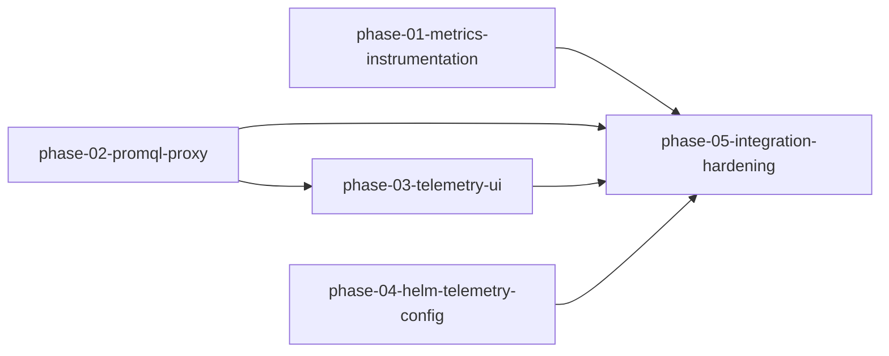

# Milestone 01 — Run Telemetry & Cost Observability

**Project:** dogfood-analytics
**Slug:** `milestone-01-telemetry-observability`
**Status:** Planned — phases dispatched

---

## Outcome Statement

An operator running a dogfood Project opens the TIDE dashboard and sees — in near-real-time and historically — token spend, wall-clock duration, dispatch counts, and failure rates at project/phase/wave granularity, plus cost-over-time charts spanning the full lifetime of a multi-day run that survive controller restarts.

When `prometheus.enabled=false` (the chart default), the dashboard degrades gracefully to live-only CRD-.status views — no error state, no broken layout.

---

## Architecture Decisions (locked — do not reinvent in phases)

### Q1 — PromQL Proxy vs. Direct Datasource — Proxy through chi server

The React dashboard is a single-page app served by the chi server. Routing Prometheus queries through new chi proxy endpoints (`GET /api/v1/query`, `GET /api/v1/query_range`) keeps single-origin semantics, requires zero Prometheus CORS reconfiguration, and confines the Prometheus endpoint URL to server-side config — the browser never needs a second network target. This matters especially in cluster deployments where Prometheus is ClusterIP-only and unreachable from outside the cluster.

The proxy forwards query/query_range parameters verbatim to the configured `prometheusEndpoint`. When `prometheusEndpoint` is empty, the proxy returns HTTP 200 with `{"status":"unavailable"}` — a sentinel the React layer checks to activate the graceful-degradation path. This is deliberately not a 503 (which would trigger error handling). When Prometheus is configured but returns a non-2xx, the proxy returns HTTP 502 with `{"status":"error","message":"..."}` — distinct from the unconfigured sentinel so React can differentiate "not configured" from "unreachable."

### Q2 — Cardinality Budget Enforcement — CI lint + runtime defense-in-depth

Per-task Prometheus labels are forbidden — cardinality explosion on clusters with many tasks. Enforcement at two layers:

1. **Primary — CI lint rule:** `hack/check-metric-labels/main.go` is a Go AST scanner invoked by `make check-metric-labels` (wired into `make lint`). It walks every `prometheus.New{Counter,Gauge,Histogram,Summary}Vec` call site and fails if any `[]string` label-name argument includes `"task"`. Catches violations at PR time, before they merge or reach runtime.

2. **Defense-in-depth — runtime guard:** `internal/metrics.MustRegisterGuarded` wraps `metrics.Registry.MustRegister`. It inspects `Desc()` of each collector at registration time and panics at controller startup if a forbidden `"task"` label is present. Violations that slip through lint are caught before the first scrape reaches production.

Approved label dimensions: `{project}`, `{project, phase}`, `{project, phase, plan}`, `{project, phase, wave}`. Anything finer is forbidden.

### Q3 — Prometheus Retention — Expose `prometheus.retentionTime`, document 30d minimum

Default Prometheus retention is 15 days — sufficient to cover a single multi-day run plus a one-week post-completion analysis window. Operators running continuous dogfood workflows (multiple projects over weeks) need longer retention for cost-over-time trend charts.

The Helm chart exposes `prometheus.retentionTime` (default `"15d"`) with a `values.yaml` comment block documenting: (a) the retention math for a multi-day run plus analysis window, (b) the recommendation to set `"30d"` or longer for organizations tracking cost trends across multiple runs. When the chart manages a bundled Prometheus instance, this value is passed as `--storage.tsdb.retention.time`. Standalone Prometheus deployments are directed to the same flag in their own configuration.

---

## Scope

### New Prometheus Metrics

These six metrics complement the existing `internal/metrics/registry.go` inventory. All use the approved `{project, phase, wave}` label set — within the cardinality budget. Existing metrics (`tide_waves_dispatched_total`, `tide_tasks_completed_total`, `tide_tasks_failed_total`, `tide_dispatch_latency_seconds`) are unchanged.

| Metric | Type | Labels | Source callsite |
|--------|------|--------|-----------------|
| `tide_tokens_input_total` | Counter | `project, phase, wave` | TaskReconciler terminal-success branch, after `RollUpUsage` |
| `tide_tokens_output_total` | Counter | `project, phase, wave` | Same |
| `tide_tokens_cache_read_total` | Counter | `project, phase, wave` | Same — `Usage.CacheReadTokens` |
| `tide_tokens_cache_creation_total` | Counter | `project, phase, wave` | Same — `Usage.CacheCreationTokens` |
| `tide_cost_cents_total` | Counter | `project, phase, wave` | Same — `Usage.EstimatedCostCents` |
| `tide_task_duration_seconds` | Histogram | `project, phase, wave` | TaskReconciler — `CompletedAt.Sub(StartedAt)` |

The `wave` label value is the owning Wave CRD name, resolved by walking the Task owner-reference chain at reconcile time — the same pattern already used for `project` resolution via `resolveProject`. No new CRD fields; no `.status` changes.

### Dashboard Backend

Two new GET endpoints in `cmd/dashboard/api/prometheus.go`:

- `GET /api/v1/query` — instant query proxy (passes through `query`, `time` params).
- `GET /api/v1/query_range` — range query proxy (passes through `query`, `start`, `end`, `step` params).

`Dependencies` in `router.go` gains `PrometheusEndpoint string`. `RegisterRoutes` wires both handlers (always registered; they self-degrade when `PrometheusEndpoint` is empty). The dashboard binary (`cmd/dashboard/main.go`) reads the `PROM_ENDPOINT` env directly via `os.Getenv("PROM_ENDPOINT")` and passes it to `Dependencies.PrometheusEndpoint`. The dashboard Deployment in the Helm chart injects this env from `prometheus.endpoint` when non-empty.

### Dashboard UI

New **Telemetry** tab in `AppShell`, alongside the existing Planning and Execution DAG views:

- **Project budget card** — live from `Project.Status.Budget` (always available): tokens spent, estimated cost, window start. No Prometheus required.
- **Cost-over-time chart** — `tide_cost_cents_total` via `query_range`, 24h/7d/30d selector. Shown when Prometheus is available.
- **Dispatch counts panel** — `tide_waves_dispatched_total` and `tide_tasks_completed_total` via `query_range`.
- **Failure rate panel** — `tide_tasks_failed_total` broken down by `reason` label.
- **Token breakdown panel** — input / output / cache-read / cache-creation stacked bars.

Stack: React + TypeScript + Tailwind (existing). Charting via `recharts` (lightweight, DOM-based — consistent with the React Flow DOM-node philosophy; no canvas libraries). If `recharts` is absent from `package.json`, it is the only new dependency.

**Graceful-degradation contract (first-class deliverable):**

- `PrometheusEndpoint` empty — proxy returns `{"status":"unavailable"}` — each chart panel slot renders a `TelemetryUnavailableNotice` component (non-error Tailwind styling, no spinner, no blank space). Live budget card always renders.
- `PrometheusEndpoint` set but unreachable — proxy returns HTTP 502 `{"status":"error",...}` — same `TelemetryUnavailableNotice` with "Prometheus unreachable" text. Same non-error visual treatment.
- CRD `.status` unavailable — handled by existing `ErrorState` / `EmptyState` components, no change.

### Helm Chart Updates

- `prometheus.retentionTime: "15d"` — new value, default 15d, `values.yaml` comment documents 30d+ for multi-run cost tracking.
- `prometheus.endpoint: ""` — new value; when non-empty, injected as `PROM_ENDPOINT` env in the dashboard Deployment.
- Comment block in `values.yaml` explains the PromQL proxy architecture choice and the retention recommendation with explicit retention math.

### Cardinality Enforcement

- `hack/check-metric-labels/main.go` — Go AST scanner, ~100 LOC, Apache 2.0 header.
- `make check-metric-labels` target — runs scanner against `./...`.
- `make lint` gains `check-metric-labels` as a prerequisite.
- `internal/metrics.MustRegisterGuarded` — thin runtime wrapper (~20 LOC) that panics at controller startup on any collector exposing a `"task"` label.

---

## Phase Decomposition

Five phases. Interface contracts (metric names + label sets, proxy HTTP contract, `PROM_ENDPOINT` env name) are locked in this document, so the planning DAG is shallow: phases 01, 02, and 04 dispatch in parallel; 03 consumes 02's HTTP contract; 05 is the milestone-wide join barrier.

### phase-01-metrics-instrumentation — *(no dependencies)*

Reconciler-side telemetry and cardinality enforcement, pure Go. Adds the six token/cost/duration metrics to `internal/metrics/registry.go` (Scope table above) and increments them in the TaskReconciler terminal branches from the provider `Usage` struct — wave label resolved via the owner-reference chain, same pattern as `resolveProject`. Ships the `hack/check-metric-labels` AST lint, the `make check-metric-labels` / `make lint` wiring, and `internal/metrics.MustRegisterGuarded`. Deliverable boundary: new metrics visible in `/metrics` scrape output under integration test; lint fails on a synthetic `"task"`-label fixture. No dashboard, no Helm changes. OTel paths untouched.

### phase-02-promql-proxy — *(no dependencies)*

Dashboard backend only. Adds `GET /api/v1/query` and `GET /api/v1/query_range` chi proxy handlers in `cmd/dashboard/api/prometheus.go`, the `PrometheusEndpoint` field in `Dependencies` (populated via the `PROM_ENDPOINT` env read directly by the dashboard binary), and the degradation contract: HTTP 200 `{"status":"unavailable"}` when unconfigured, HTTP 502 `{"status":"error",...}` when configured-but-unreachable. Deliverable boundary: handler unit tests (`httptest` test-double Prometheus) prove all three response shapes. Proxies arbitrary PromQL — does not depend on phase 01's metrics existing.

### phase-03-telemetry-ui — *(depends on: phase-02-promql-proxy)*

React Telemetry tab in `AppShell`: always-live Project budget card from `.status`, cost-over-time / dispatch-count / failure-rate / token-breakdown panels via the phase-02 proxy, charting with `recharts`, and the `TelemetryUnavailableNotice` graceful-degradation component for both the unconfigured sentinel and the 502 path. Deliverable boundary: Vitest component tests mock both proxy response shapes; dashboard renders without JS errors in Prometheus-enabled and -disabled modes. PromQL expressions use the metric names locked in the Scope table. Depends on phase 02 for the live HTTP contract its integration surface targets.

### phase-04-helm-telemetry-config — *(no dependencies)*

Helm chart and operator docs. Adds `prometheus.retentionTime` (default `"15d"`, comment documents the 30d+ recommendation and the retention math) and `prometheus.endpoint` (when non-empty, injected as `PROM_ENDPOINT` into the dashboard Deployment — env name locked above), plus the `values.yaml` comment block explaining the proxy architecture choice. Deliverable boundary: `helm template` renders the retention flag and env injection correctly for enabled/disabled permutations.

### phase-05-integration-hardening — *(depends on: phase-01, phase-02, phase-03, phase-04)*

The milestone's join barrier. Verifies every exit criterion end-to-end: six metrics in scrape output after a Task completes in the integration suite, proxy + UI degradation paths in both Prometheus modes, `helm template` permutations, PERSIST-02 review of all `.status` touches, cardinality lint green against the full tree, and `make test` exit 0. Fixes whatever the join surfaces; authors no new feature scope.

---

## Exit Criteria

1. `make test` exits 0 — all existing unit and integration tests pass unmodified.
2. `make check-metric-labels` fails when run against a synthetic test fixture registering a `prometheus.NewCounterVec` with a `"task"` label; passes against all current `internal/metrics` call sites.
3. The six new token/cost metrics appear in the `/metrics` scrape output after one Task completes in the integration test suite.
4. `GET /api/v1/query_range` through the chi proxy returns a valid Prometheus JSON envelope when a test-double Prometheus instance is configured (handler unit test with `httptest`).
5. `GET /api/v1/query_range` returns HTTP 200 `{"status":"unavailable"}` when `prometheusEndpoint` is empty (handler unit test in `cmd/dashboard/api/prometheus_test.go`).
6. Dashboard renders without JavaScript errors in both Prometheus-enabled and Prometheus-disabled modes — verified by Vitest component tests mocking both proxy response shapes.
7. `helm template` with `prometheus.retentionTime=30d` produces the retention flag in rendered output (or documents via `values.yaml` comment that the flag applies to operator-managed Prometheus).
8. No CRD `.status` field on any Kind carries derived metric aggregates — PERSIST-02 invariant maintained (verified by code review of all `.status` additions in this milestone).

---

## Constraints (inherited)

- No new DB, no SQLite, no external store beyond Prometheus.
- `.status` carries only live operational state — no derived aggregates (PERSIST-02).
- No per-task Prometheus labels (cardinality budget, CI + runtime enforcement above).
- Prometheus-disabled path renders without errors (graceful degradation above).
- Apache 2.0 headers on all new files, logr/zap logging, CEL validation for any new CRD fields, controller-runtime patterns throughout.
- OTel/OpenInference tracing (`pkg/otelai/`) remains orthogonal — no token counts routed through OTel.
- Instrument reconcilers only — do not add ad-hoc accounting to the subagent image.

---

## Upstream / Downstream Milestones

- **Upstream:** v1.0.0 Self-Hosting MVP (shipped 2026-06-11) — provides the reconciler infrastructure, `internal/metrics` registry, chi dashboard server, React/TypeScript/Tailwind stack, and `pkg/dispatch.Usage` struct this milestone instruments.
- **Downstream:** None currently scoped. Future milestones may add Grafana dashboards-as-code, alerting rules, or multi-cluster cost aggregation.
