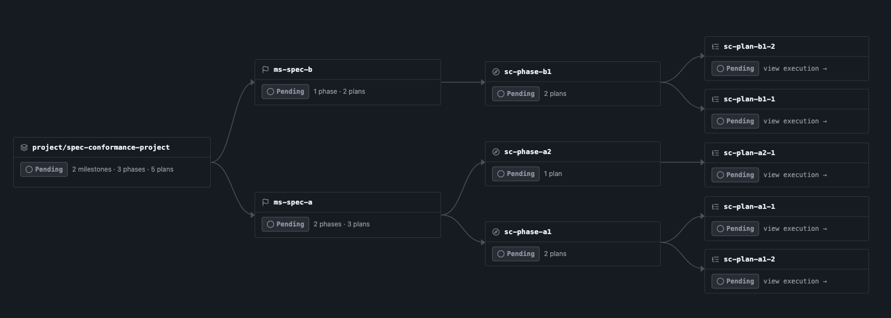
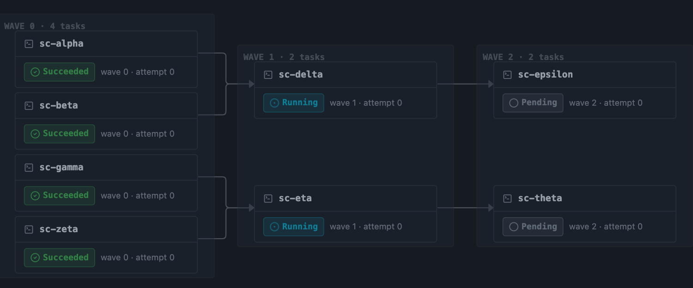

# TIDE

[](https://github.com/jsquirrelz/tide/actions/workflows/ci.yaml)
[](https://github.com/jsquirrelz/tide/actions/workflows/test.yml)
[](https://github.com/jsquirrelz/tide/actions/workflows/lint.yml)
[](https://github.com/jsquirrelz/tide/actions/workflows/release.yaml)
[](LICENSE)

TIDE is a Kubernetes-native control plane for autonomous coding work. It turns an outcome into CRD-backed planning and execution DAGs, dispatches subagents in dependency-safe waves, tracks cost, gates progress, and pushes reviewable run branches.

TIDE stands for **Topologically-Indexed Dependency Execution**. The important part is practical: work is ordered by declared dependencies, not by prose, convention, or a single long prompt.

## Why TIDE

TIDE is built for agentic software work that is too large, too expensive, or too risky to hand to one context window.

- **Explicit dependency graph.** Projects decompose into Milestones, Phases, Plans, Tasks, and derived Waves. Cycles are rejected instead of becoming runtime surprises.
- **Parallelism without guessing.** Tasks in the same wave have no mutual dependencies, so they can run concurrently. Later waves wait for their prerequisites.
- **Reviewable artifacts.** Each level produces material a human can inspect: milestone docs, phase briefs, plan files, task diffs, and status conditions.
- **Kubernetes operational model.** TIDE ships as CRDs, controllers, Jobs, RBAC, Helm charts, a read-only dashboard, and a kubeconfig-native CLI.
- **Cost and safety controls.** Real LLM runs support budget caps, per-level model selection, human gates, secret-mounted credentials, gitleaks scanning, and push-to-run-branch behavior.
- **Resumable runs.** Export a project's planner envelopes to a portable bundle and import it into a fresh run, adopting completed planning instead of re-paying for it — with an offline dry-run that previews what would be adopted vs re-planned.

## How It Works

TIDE has two different DAGs:

- **Planning DAG:** which artifacts must exist before another artifact can be authored.
- **Execution DAG:** which code mutations must complete before another mutation can run.

Waves are derived from the execution DAG with layered topological sorting. Operators declare dependencies; TIDE computes the schedule.





Read [docs/concepts.md](docs/concepts.md) for the full mental model, including the five-level hierarchy and wave derivation.

## Quickstart: $0 Local Demo

This path installs TIDE into a local kind cluster and runs the checked-in `small` sample. It uses the stub subagent, makes no LLM API calls, and requires no API key.

Prerequisites: `docker` or compatible runtime, `kubectl`, `helm`, and `kind`. See [docs/INSTALL.md](docs/INSTALL.md) for per-OS setup and troubleshooting.

```bash
VERSION=1.0.1

kind create cluster --name tide-demo

# cert-manager is required by the TIDE chart's webhook and metrics certificates.
kubectl apply -f https://github.com/cert-manager/cert-manager/releases/download/v1.20.2/cert-manager.yaml
kubectl -n cert-manager rollout status deployment/cert-manager --timeout=120s
kubectl -n cert-manager rollout status deployment/cert-manager-cainjector --timeout=120s
kubectl -n cert-manager rollout status deployment/cert-manager-webhook --timeout=120s

# Install CRDs first, then the controller/dashboard chart.
helm install tide-crds oci://ghcr.io/jsquirrelz/tide-charts/tide-crds \
  --version "${VERSION}" -n tide-system --create-namespace
helm install tide oci://ghcr.io/jsquirrelz/tide-charts/tide \
  --version "${VERSION}" -n tide-system

kubectl rollout status deployment/tide-controller-manager -n tide-system --timeout=5m
kubectl rollout status deployment/tide-dashboard -n tide-system --timeout=5m

# Apply the $0 sample from the matching release tag.
kubectl apply -f "https://raw.githubusercontent.com/jsquirrelz/tide/v${VERSION}/examples/projects/small/project.yaml"

# Mirror the chart-generated signing key into the sample namespace.
SIGNING_KEY=$(kubectl get secret tide-signing-key -n tide-system -o jsonpath='{.data.TIDE_SIGNING_KEY}')
kubectl apply -f - <<EOF
apiVersion: v1
kind: Secret
metadata: { name: tide-signing-key, namespace: tide-sample-small }
type: Opaque
data: { TIDE_SIGNING_KEY: ${SIGNING_KEY} }
EOF

# Watch the Project complete.
kubectl wait --for=jsonpath='{.status.phase}'=Complete \
  project/small-project -n tide-sample-small --timeout=10m
```

To inspect the run visually:

```bash
kubectl port-forward -n tide-system svc/tide-dashboard 8080:80
open http://localhost:8080
```

The small sample is intentionally not a production template. It uses a stub image and a placeholder repo URL so operators can verify CRD admission, controller dispatch, Job lifecycle, status progression, and dashboard wiring without spending money.

## Running Against A Real Repo

Real TIDE runs spend LLM budget and push commits. Before pointing TIDE at a repository that matters, read [docs/production.md](docs/production.md).

The safety contract in v1 is:

- TIDE pushes to `tide/run-<project>-<unix-time>`, not to your default branch.
- Pushes use branch-scoped `--force-with-lease`; TIDE does not merge for you.
- Provider keys and git PATs live in same-namespace Kubernetes Secrets and are mounted into Job pods, not embedded in manifests.
- Push Jobs run gitleaks before publishing artifacts.
- `budget.absoluteCapCents: 0` means unlimited spend for a real subagent. Set a non-zero cap for production.
- Gate policies can require approval at milestone, phase, plan, task, or wave boundaries.

A real Project is a Kubernetes custom resource:

```yaml
apiVersion: tideproject.k8s/v1alpha1
kind: Project
metadata:
  name: example-project
  namespace: tide-example
spec:
  targetRepo: https://github.com/example-org/example-repo.git
  outcomePrompt: |
    Add a small, well-tested capability to this repository.
    Keep the scope narrow and make the final branch reviewable.

  providerSecretRef: tide-anthropic-creds

  budget:
    absoluteCapCents: 2500
    rollingWindowCapCents: 1000
    rollingWindowDuration: 24h

  subagent:
    image: ghcr.io/jsquirrelz/tide-claude-subagent:1.0.1
    model: claude-sonnet-4-6
    levels:
      task:
        model: claude-haiku-4-5

  git:
    repoURL: https://github.com/example-org/example-repo.git
    credsSecretRef: tide-git-creds

  gates:
    milestone: approve
    phase: auto
    plan: auto
    task: auto
    pauseBetweenWaves: false

  planAdmission:
    fileTouchMode: strict
```

See [docs/project-authoring.md](docs/project-authoring.md) for the full `Project.Spec` reference and sample walkthroughs.

## Operator Surfaces

TIDE ships four main operator surfaces:

- **CRDs:** `Project`, `Milestone`, `Phase`, `Plan`, `Task`, and `Wave` under `tideproject.k8s`.
- **Helm charts:** `tide-crds` for CRDs and `tide` for controller, dashboard, RBAC, webhooks, metrics, and runtime config.
- **CLI:** `tide` and `kubectl tide` manage Projects, watch status, inspect waves and budgets, stream task logs, drive gates, and export/import envelope bundles for run resumption. See [docs/cli.md](docs/cli.md).
- **Dashboard:** read-only UI for project status, planning and execution DAGs, logs, budget state, and telemetry. Mutating actions are shown as CLI commands instead of browser-side writes. See [docs/dashboard.md](docs/dashboard.md).

## Examples

Samples live under [examples/projects](examples/projects/):

| Sample | Cost | Purpose | External credentials |
| --- | ---: | --- | --- |
| [small](examples/projects/small/) | $0 | Stub-subagent smoke test for install and dispatch plumbing | None |
| [medium](examples/projects/medium/) | about $5 | Real Claude run against an in-cluster HTTP git remote | Anthropic API key |
| [large](examples/projects/large/) | about $25 | Maintainer acceptance run against this TIDE repo | Anthropic API key and GitHub PAT |

Start with `small`. Use `medium` only after the dashboard, signing key, namespace resources, and provider Secret path are clear. Treat `large` as a maintainer acceptance ritual, not a casual first run.

## Status And Limits

TIDE is useful today, but the boundaries are intentional:

- The concrete in-tree real subagent is Claude-backed. The subagent interface is pluggable, but other concrete providers are v1.x work.
- Production git transport is HTTPS plus PAT. `file://` is rejected, and SSH support has host-key caveats.
- Concurrent execution requires a ReadWriteMany workspace PVC. The `$0` small sample uses ReadWriteOnce because it is serialized for kind/minikube smoke testing.
- One namespace per Project is the supported multi-tenant pattern. Cross-namespace Secret refs are not supported.
- The dashboard is read-only. Approve, reject, resume, and cancel flows go through the CLI or Kubernetes annotations.
- Supply-chain signing and SLSA provenance are deferred to later hardening work.

## Documentation

- [Install guide](docs/INSTALL.md): prerequisites, Helm install, namespace bootstrap, first sample, uninstall.
- [Concepts](docs/concepts.md): hierarchy, planning DAG, execution DAG, waves, and vocabulary.
- [Project authoring](docs/project-authoring.md): `Project.Spec`, cost-tiered samples, provider settings.
- [Production checklist](docs/production.md): repo safety, budget safety, cluster sizing, gates, limitations.
- [Gates](docs/gates.md): `auto`, `approve`, `pause`, `tide approve`, `tide reject`, `tide resume`.
- [CLI](docs/cli.md): install paths and verb reference.
- [Dashboard](docs/dashboard.md): deployment, access, auth posture, telemetry.
- [Observability](docs/observability.md): logs, metrics, traces, ServiceMonitor, PromQL proxy.
- [Git hosts](docs/git-hosts.md): PAT setup for GitHub, GitLab, and Gitea.
- [Troubleshooting](docs/troubleshooting.md): symptom, cause, and recovery recipes.

## Development

Common contributor commands:

```bash
make test          # unit tier
make test-int-fast # envtest integration tier
make lint          # golangci-lint plus custom analyzers
make helm          # regenerate Helm charts
```

The heavier kind integration and e2e suites run in nightly CI and are available locally through `make test-int` and `make test-e2e-kind`.

## Contributing, Security, License

- Contributions: [CONTRIBUTING.md](CONTRIBUTING.md)
- Security reports: [SECURITY.md](SECURITY.md)
- License: [Apache-2.0](LICENSE)
